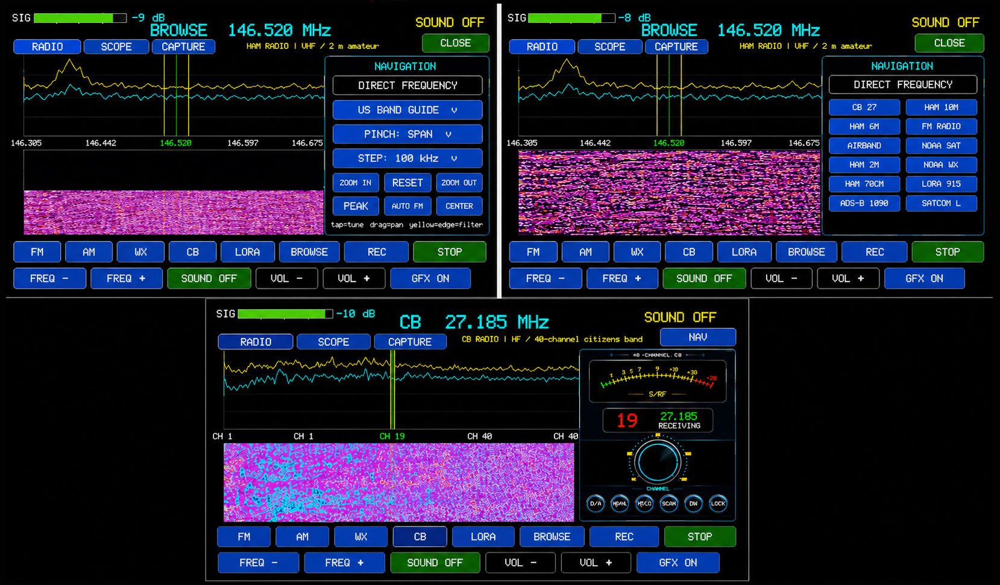

# OrcSDR

<p align="center">
  <strong>Portable, standalone software-defined radio on the ESP32-P4</strong>
</p>

<p align="center">
  <strong>RTL-SDR Blog V4 → USB High-Speed → ESP32-P4 → DSP + Touch UI + Audio</strong>
</p>

**OrcSDR turns an ESP32-P4 into a self-contained software-defined radio using an RTL-SDR Blog V4 directly over USB — no PC, Raspberry Pi, or desktop SDR application required.**

<p align="center">
  
</p>

OrcSDR combines a touchscreen radio interface, live spectrum and waterfall visualization, audio, tuning, signal monitoring, radio tools, and a clean-room **ESP-IDF USB Host driver for the RTL-SDR Blog V4**.

The primary reference implementation runs on the **M5Stack Tab5**, powered by the **ESP32-P4**.

> [!IMPORTANT]
> **Tab5 builds are native ESP-IDF.** Arduino and M5Stack libraries are ESP-IDF
> components only; PlatformIO is not a supported build, flash, or release path.
> See [`docs/TAB5_BUILD_POLICY.md`](docs/TAB5_BUILD_POLICY.md) for the exact
> P4/C6 ESP-Hosted 2.12.6 pairing and release gate.

**Core technologies:** ESP32-P4 · M5Stack Tab5 · RTL-SDR Blog V4 · ESP-IDF USB Host · Software-Defined Radio · DSP · Spectrum · Waterfall · LoRa

<p align="center">
  <a href="#-flash-orcsdr-to-the-m5stack-tab5"><strong>Flash OrcSDR</strong></a>
  &nbsp;•&nbsp;
  <a href="#orcsdr-interface"><strong>Interface</strong></a>
  &nbsp;•&nbsp;
  <a href="#lora-monitoring--messaging"><strong>LoRa</strong></a>
  &nbsp;•&nbsp;
  <a href="#rtl-sdrv4-esp"><strong>RTL-SDRv4-ESP Driver</strong></a>
  &nbsp;•&nbsp;
  <a href="#development-roadmap"><strong>Roadmap</strong></a>
</p>

> [!IMPORTANT]
> **Have a M5Stack Tab5 and RTL-SDR Blog V4?**
>
> Jump directly to **[Flash OrcSDR to the M5Stack Tab5](#-flash-orcsdr-to-the-m5stack-tab5)** to get started.

> [!NOTE]
> **Project status:** OrcSDR is under active development. The Tab5 application is the reference implementation while the reusable `RTL-SDRv4-ESP` driver continues to be separated and hardened as a standalone ESP-IDF component.

---

## Why OrcSDR?

Traditional RTL-SDR systems usually depend on a desktop computer, Raspberry Pi, or another general-purpose host running SDR software.

OrcSDR takes a different approach:

```text
Traditional SDR

RTL-SDR
   │
   ▼
PC / Raspberry Pi
   │
   ▼
Desktop SDR Application
```

```text
OrcSDR

RTL-SDR Blog V4
   │
   │ USB High-Speed
   ▼
ESP32-P4
   │
   ├── DSP
   ├── Spectrum
   ├── Waterfall
   ├── Audio
   ├── Touch UI
   └── Radio Tools
```

The **ESP32-P4 communicates directly with the RTL-SDR Blog V4 through USB Host**, processes radio data locally, and provides the complete user interface directly on the Tab5 display.

**The result is a portable, embedded SDR appliance instead of a peripheral that needs a computer attached to it.**

---

## What is OrcSDR?

OrcSDR explores how much of the traditional PC-based software-defined radio stack can be moved onto embedded hardware.

The goal is not to reproduce a desktop SDR workstation on an ESP32.

The goal is to make **useful, portable, self-contained radio appliances** possible using inexpensive SDR hardware and embedded processors.

The current reference system looks like this:

```text
┌─────────────────────┐        USB Host        ┌──────────────────┐
│                     │◄──────────────────────►│                  │
│      ESP32-P4       │                        │ RTL-SDR Blog V4  │
│    M5Stack Tab5     │                        │                  │
│                     │                        └────────┬─────────┘
│  DSP                │                                 │
│  Touch UI           │                              RF Input
│  Audio              │
│  Spectrum           │
│  Waterfall          │
│  Radio Controls     │
└─────────────────────┘
```

**No desktop SDR application is required.**

---

## OrcSDR Interface

OrcSDR is designed around a touchscreen-first radio experience.

<p align="center">
  
</p>

The interface combines live spectrum and waterfall displays with direct frequency tuning, band navigation, presets, signal monitoring, and dedicated radio modes.

Current interface work includes:

- FM broadcast radio
- AM radio
- Weather Radio / WX
- VHF and amateur-radio spectrum browsing
- CB radio interface
- Frequency presets
- Spectrum zoom and navigation
- Touch tuning
- Scope scroll-tuning
- Signal strength monitoring
- Speaker and volume control
- IQ capture tools

---

## LoRa Monitoring & Messaging

OrcSDR also includes dedicated **LoRa radio tooling** for monitoring digital radio activity directly on the ESP32-P4 / M5Stack Tab5 platform.

The LoRa interface combines packet monitoring, signal telemetry, a live scope, waterfall visualization, message monitoring, and radio controls in one touchscreen view.

<p align="center">
  
</p>

Current LoRa capabilities include:

- Live packet and telemetry monitoring
- Packet ID and node information
- RSSI / SNR signal information
- Live scope visualization
- Waterfall display
- Message monitoring
- Frequency controls
- Bandwidth controls
- Spreading-factor controls
- IQ capture support
- LoRa-specific radio status and diagnostics

<p align="center">
  <strong>Ready to try it on real hardware?</strong><br>
  <a href="#-flash-orcsdr-to-the-m5stack-tab5">Flash OrcSDR to your M5Stack Tab5 →</a>
</p>

---

# 🚀 Flash OrcSDR to the M5Stack Tab5

> [!IMPORTANT]
> **Fastest path to running OrcSDR on real hardware**
>
> Reference hardware: **M5Stack Tab5 + RTL-SDR Blog V4**

### Requirements

- **M5Stack Tab5**
- **RTL-SDR Blog V4**
- **Espressif ESP-IDF 5.5.3 for Windows**
- **M5Burner ESP-Hosted 2.12.6 slave firmware** for the Tab5 C6
- USB cable for flashing the Tab5
- USB connection from the Tab5 USB Host port to the RTL-SDR
- Antenna appropriate for what you want to receive

### 1. Clone OrcSDR

```bash
git clone https://github.com/hardcoreerik/OrcSDR.git
cd OrcSDR
```

If you already have OrcSDR cloned:

```bash
cd OrcSDR
git pull
```

### 2. Find the Tab5 port

Connect the Tab5 to your computer over USB and run:

```powershell
Get-CimInstance Win32_SerialPort | Select-Object DeviceID, Name
```

On Windows, note the assigned COM port. For example:

```text
COM8
```

### 3. Install OrcSDR

ESP-IDF 5.5.3 must already be installed. Then from the repo root:

```powershell
Set-ExecutionPolicy -Scope Process Bypass
.\install-orcsdr.ps1
```

The script installs `requirements.txt`, finds the Tab5 COM port (or pass
`-Port COM8`), builds and flashes the P4, and checks that ESP-Hosted
**host and C6 slave are both 2.12.6**. A mismatch prints M5Burner steps;
the P4 image cannot update the C6. Re-check with
`.\install-orcsdr.ps1 -CheckHostedOnly`.

Saved NVS settings are preserved. PlatformIO is not a supported OrcSDR
build or flash path.

### 4. Connect the RTL-SDR Blog V4

Connect the SDR to the Tab5 USB Host interface:

```text
M5Stack Tab5
     │
 USB Host
     │
     ▼
RTL-SDR Blog V4
     │
 RF Input
     │
     ▼
  Antenna
```

Power-cycle or reset the Tab5 after flashing if needed.

> [!NOTE]
> OrcSDR is under active development. Some radio modes, DSP paths, and controls are experimental and may change between releases.

---

## Features

### Radio

- RTL-SDR Blog V4 connected directly to ESP32-P4 over USB Host
- FM demodulation
- AM demodulation
- Weather Radio / WX
- CB radio interface
- Frequency tuning
- Adjustable bandwidth
- Signal strength monitoring
- Speaker audio
- Volume control
- IQ capture support

### Spectrum & Visualization

- Live spectrum display
- Live waterfall display
- Touch-driven frequency navigation
- Frequency presets
- Spectrum zoom
- Band navigation
- Signal status
- Full-screen M5Stack Tab5 interface

### Radio Tools

- VHF spectrum browsing
- Amateur-radio band navigation
- CB interface
- LoRa packet and message monitoring
- IQ capture
- Recording and analysis tooling
- Frequency and bandwidth controls

### Platform

- ESP32-P4
- M5Stack Tab5 reference hardware
- ESP-IDF USB Host
- PlatformIO build environment
- Reusable `RTL-SDRv4-ESP` component
- Clean-room RTL-SDR Blog V4 USB implementation

---

## Hardware

The current reference platform is:

| Component | Hardware |
| --- | --- |
| MCU | **ESP32-P4** |
| Reference device | **M5Stack Tab5** |
| SDR | **RTL-SDR Blog V4** |
| Interface | USB Host |
| USB VID:PID | `0bda:2838` |
| USB manufacturer | `RTLSDRBlog` |
| USB product | `Blog V4` |

The **ESP32-P4 High-Speed USB Host** is the currently measured reference target.

ESP32-S2 and ESP32-S3 support is **not currently claimed** until those platforms have been measured and validated.

---

## Repository Layout

```text
OrcSDR/
├── apps/
│   └── orcsdr-tab5/             M5Stack Tab5 SDR application
│
├── components/
│   └── rtl_sdr_v4_esp/          Reusable RTL-SDR Blog V4 driver
│
├── examples/
│   └── p4_serial_smoke/         Minimal ESP32-P4 driver example
│
├── docs/                        Technical documentation
│   ├── API_RTL_SDR_V4_ESP.md
│   ├── PORTING.md
│   ├── FM_DSP_CAPTURE_LAB.md
│   └── RTL_SDR_V4_CLEAN_ROOM_SPEC.md
│
├── tools/                       Capture, transfer, analysis, and test tools
│
├── LICENSE
└── README.md
```

---

# OrcSDR Tab5 Application

`apps/orcsdr-tab5/` contains the primary OrcSDR application.

It provides the user-facing SDR experience on the M5Stack Tab5, including the radio UI, spectrum and waterfall displays, audio controls, touch interaction, and radio-specific modes.

Current UI capabilities include:

- Spectrum and waterfall visualization
- FM / AM / WX radio modes
- CB interface
- LoRa monitoring and messaging
- Touch tuning and scope navigation
- Frequency presets and band navigation
- Speaker and volume control
- Signal and radio status
- IQ capture tools

Application-specific documentation is available here:

**[`apps/orcsdr-tab5/README.md`](apps/orcsdr-tab5/README.md)**

---

# RTL-SDRv4-ESP

At the core of OrcSDR is **RTL-SDRv4-ESP**, a standalone ESP-IDF USB Host driver for the **RTL-SDR Blog V4**.

This driver is a major part of the OrcSDR project: it is intended to let ESP32-P4 applications communicate with an RTL-SDR V4 directly, without relying on a desktop host or the OrcSDR user interface.

```text
components/rtl_sdr_v4_esp/
├── include/
│   └── rtl_sdr_v4_esp.h
├── src/
│   └── rtl_sdr_v4_esp.cpp
├── private/
│   └── rtl_sdr_v4_transfers.hpp
├── CMakeLists.txt
├── Kconfig
├── idf_component.yml
└── README.md
```

The component is designed to remain independent enough that it can eventually be used in ESP-IDF projects without requiring the OrcSDR Tab5 UI.

---

## Using the Driver Component

Copy or submodule:

```text
components/rtl_sdr_v4_esp
```

into your ESP-IDF project's `components/` directory.

Alternatively:

```cmake
set(EXTRA_COMPONENT_DIRS /path/to/OrcSDR/components)
```

Basic initialization:

```cpp
#include "rtl_sdr_v4_esp.h"

rtl_sdr_v4_esp_config_t cfg;
rtl_sdr_v4_esp_config_default(&cfg);

rtl_sdr_v4_esp_handle_t sdr;

ESP_ERROR_CHECK(
    rtl_sdr_v4_esp_install(&cfg, &sdr)
);
```

---

## Driver Status

The public `RTL-SDRv4-ESP` API is currently **v0.3.0**.

Current API work includes:

- Input validation
- Locking
- Reentrancy protection
- Idempotent teardown
- Capability discovery
- Clean-room transfer tables
- USB device identity validation

The driver extraction is still in progress.

Full bulk-stream extraction from the Tab5 application is tracked in:

**[`docs/PORTING.md`](docs/PORTING.md)**

Until **Gate 2** is complete, `start` returns:

```text
RTL_SDR_V4_ESP_ERR_UNSUPPORTED
```

See the current API contract:

**[`docs/API_RTL_SDR_V4_ESP.md`](docs/API_RTL_SDR_V4_ESP.md)**

---

## Device Identity

The driver currently accepts the measured RTL-SDR Blog V4 identity:

```text
VID:          0bda
PID:          2838
Manufacturer: RTLSDRBlog
Product:      Blog V4
```

The initial target is deliberately narrow while the implementation and USB behavior are validated.

---

## Target Support

| MCU | USB Host | Status |
| --- | --- | --- |
| **ESP32-P4** | High-Speed | ✅ Measured reference platform |
| ESP32-S3 | Full-Speed | ⚠️ Not currently claimed |
| ESP32-S2 | Full-Speed | ⚠️ Not currently claimed |

The **M5Stack Tab5 / ESP32-P4** combination is the primary development and validation platform.

---

## Clean-Room Implementation

`RTL-SDRv4-ESP` is being developed as a **clean-room implementation** of the USB behavior required to operate the RTL-SDR Blog V4.

The implementation is not derived from `librtlsdr` source code.

Measured and documented USB behavior lives in:

**[`docs/RTL_SDR_V4_CLEAN_ROOM_SPEC.md`](docs/RTL_SDR_V4_CLEAN_ROOM_SPEC.md)**

The intent is to keep the device behavior specification separate from the ESP32 implementation.

---

## Architecture

```text
                         OrcSDR
                            │
                ┌───────────┴───────────┐
                │                       │
          Tab5 Touch UI            Radio / DSP
                │                       │
                └───────────┬───────────┘
                            │
                     RTL-SDRv4-ESP
                            │
                     ESP-IDF USB Host
                            │
                       USB High-Speed
                            │
                    RTL-SDR Blog V4
                            │
                           RF
```

The long-term goal is to keep the SDR driver modular enough that other ESP32-P4 applications can use it without depending on the OrcSDR user interface.

---

## Development Roadmap

OrcSDR is moving from a working reference radio toward a more reusable embedded SDR platform.

Current areas of development include:

- Complete RTL-SDR V4 bulk stream extraction
- Harden USB transfer handling
- Improve DSP and demodulation paths
- Improve FM audio quality
- Improve spectrum and waterfall performance
- Expand radio modes
- Expand CB, LoRa, and amateur-radio tooling
- Improve frequency and band navigation
- Continue separating radio logic from the Tab5 UI
- Validate additional ESP32 USB Host targets
- Build reusable examples around `RTL-SDRv4-ESP`

Engineering notes and current development documents include:

- [`docs/PORTING.md`](docs/PORTING.md)
- [`docs/M5TAB5_RTL_RADIO_NEXT_STEPS.md`](docs/M5TAB5_RTL_RADIO_NEXT_STEPS.md)
- [`docs/FM_DSP_CAPTURE_LAB.md`](docs/FM_DSP_CAPTURE_LAB.md)
- [`docs/IMPLEMENTATION_FROM_PEER_RESEARCH.md`](docs/IMPLEMENTATION_FROM_PEER_RESEARCH.md)
- [`docs/COMPETITIVE_ANALYSIS_ESP32_RTLSDR.md`](docs/COMPETITIVE_ANALYSIS_ESP32_RTLSDR.md)

---

## Why ESP32-P4?

The ESP32-P4 is an interesting platform for standalone SDR because it combines:

- High-Speed USB
- Significantly more processing capability than earlier ESP32 devices
- Display-oriented peripherals
- Embedded form factor
- ESP-IDF ecosystem
- Enough capability to combine USB radio control, DSP, graphics, audio, and touch interaction in one device

OrcSDR explores how much of the traditional PC-based SDR stack can be moved onto embedded hardware.

The goal isn't to reproduce a desktop SDR workstation on an ESP32.

The goal is to make **useful, portable, self-contained radio appliances** possible using inexpensive SDR hardware and embedded processors.

---

## The Orc Ecosystem

OrcSDR is part of the broader **Orc Ecosystem** — a collection of projects exploring local AI, embedded radio, mesh networking, distributed systems, and custom hardware/software integration.

- **[TheOrc](https://github.com/hardcoreerik/TheOrc)** — local-first multi-agent AI orchestration and distributed compute.
- **[OrcSDR](https://github.com/hardcoreerik/OrcSDR)** — embedded software-defined radio and RTL-SDR V4 tooling.
- **[OrcMesh](https://github.com/hardcoreerik/OrcMesh)** — LoRa, Meshtastic, MeshCore, and distributed embedded mesh networking.

Each project is useful on its own, but the larger direction is toward devices that can **communicate, observe their RF environment, process data locally, and cooperate as parts of a distributed system**.

---

## Contributing

OrcSDR is under active development.

Contributions are welcome in areas including:

- ESP32-P4 USB Host development
- DSP and demodulation
- Spectrum and waterfall rendering
- Radio UI improvements
- Hardware testing
- USB traces and measurements
- RTL-SDR V4 behavior documentation
- Radio-mode development
- Test tooling
- Documentation

When contributing to the RTL-SDR V4 driver, please preserve the project's clean-room development requirements and document the source of any device behavior or measurements used by the implementation.

---

## License

OrcSDR is licensed under **AGPL-3.0-only** by default.

See:

- [`LICENSE`](LICENSE)
- [`LICENSING.md`](LICENSING.md)

for details.

Commercial licensing terms are also available from the maintainer.

---

## Project Links

**Repository**  
https://github.com/hardcoreerik/OrcSDR

**Documentation**  
[`docs/`](docs/)

**M5Stack Tab5 Application**  
[`apps/orcsdr-tab5/`](apps/orcsdr-tab5/)

**RTL-SDRv4-ESP Driver**  
[`components/rtl_sdr_v4_esp/`](components/rtl_sdr_v4_esp/)

**The Orc Ecosystem**  
[TheOrc](https://github.com/hardcoreerik/TheOrc) · [OrcSDR](https://github.com/hardcoreerik/OrcSDR) · [OrcMesh](https://github.com/hardcoreerik/OrcMesh)

---

<p align="center">
  <strong>ESP32-P4 + RTL-SDR Blog V4 + USB High-Speed</strong><br>
  Portable, standalone software-defined radio.
</p>
