# OrcSDR

<p align="center">
  <strong>A handheld software-defined radio that does not need a PC</strong>
</p>

<p align="center">
  <strong>RTL-SDR Blog V4 → USB High-Speed → ESP32-P4 → DSP + Touch UI + Audio</strong>
</p>

**OrcSDR is a self-contained radio you hold in your hands.** Plug an RTL-SDR Blog V4 into a M5Stack Tab5, flash this firmware, and the tablet becomes the radio: live spectrum, waterfall, speaker audio, FM with RDS, P25 trunking, ADS-B, and a passive LoRa mesh monitor. There is no Raspberry Pi in the bag, no laptop running SDR#, and no desktop app you have to keep open.

<p align="center">
  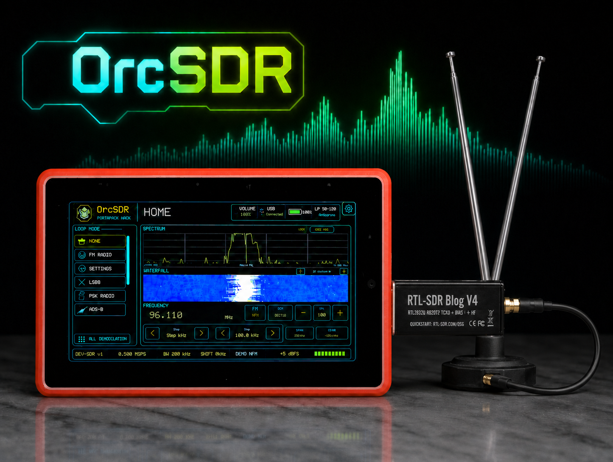
</p>

You power it on, wait for the splash to finish loading Wi-Fi and the dongle, tap **OrcSDR**, and land on Home. Home remembers the last radio you used. The spectrum and waterfall keep drawing while you listen. From there you open a dedicated dashboard for the kind of signal you actually care about, instead of one crowded “everything radio” screen.

<p align="center">
  <a href="#-flash-orcsdr-to-the-m5stack-tab5"><strong>Flash it</strong></a>
  &nbsp;•&nbsp;
  <a href="#the-dashboards"><strong>Dashboards</strong></a>
  &nbsp;•&nbsp;
  <a href="#rtl-sdrv4-esp"><strong>RTL-SDRv4-ESP driver</strong></a>
  &nbsp;•&nbsp;
  <a href="#the-orc-ecosystem"><strong>Orc ecosystem</strong></a>
</p>

> [!IMPORTANT]
> **Have a M5Stack Tab5 and an RTL-SDR Blog V4?**
>
> Jump to **[Flash OrcSDR to the M5Stack Tab5](#-flash-orcsdr-to-the-m5stack-tab5)** and run it on hardware. The screenshots on this page are from that firmware.

> [!NOTE]
> **Project status:** OrcSDR is under active development. The Tab5 app is the reference radio and builds with **native ESP-IDF 5.5.4**. M5Unified and M5GFX are ESP-IDF components only; PlatformIO is not a supported build or flash path. See [the Tab5 ESP-Hosted migration record](docs/user-guide/tab5-esp-hosted-3-migration.md) and the [reusable Tab5 Wi-Fi guide](docs/user-guide/wifi-tab5.md) for the P4/C6 pairing, pins, and acceptance status.

---

## Why this exists

Most RTL-SDR setups treat the dongle as a USB accessory for a computer:

```text
Traditional SDR

RTL-SDR
   │
   ▼
PC / Raspberry Pi
   │
   ▼
Desktop SDR application
```

OrcSDR inverts that. The ESP32-P4 talks to the Blog V4 over USB High-Speed, does the DSP locally, draws the UI on the Tab5, and plays audio out the speaker:

```text
OrcSDR

RTL-SDR Blog V4
   │
   │ USB High-Speed
   ▼
ESP32-P4 on M5Stack Tab5
   │
   ├── DSP
   ├── Spectrum + waterfall
   ├── Speaker audio
   ├── Touch dashboards
   └── Radio tools
```

The result is a portable radio appliance, not a peripheral that only works when a laptop is attached.

That is also why the interface is split into dashboards. FM listening, P25 trunking, ADS-B, and LoRa are different jobs. Each one gets its own screen, its own tabs, and its own controls, with Home as the place you always come back to.

---

## The dashboards

These are the completed dashboards in the current Tab5 firmware. Each section below is what you actually do on that screen, with a live capture of that screen. AM, weather radio, CB, and the shared “browse the whole tuner” shell are still in progress and are not shown here.

Quick map:

| Dashboard | What it is for |
| --- | --- |
| **[Home](#home)** | Last-used radios, live spectrum, listen without retuning the LO every second |
| **[FM Broadcast](#fm-broadcast)** | Tune broadcast FM, hear stereo, read RDS |
| **[P25 Trunking](#p25-trunking)** | Follow a programmed P25 system on a single tuner |
| **[ADS-B](#ads-b)** | 1090 MHz aircraft radar, list, and target detail |
| **[LoRa Mesh](#lora-mesh)** | Passive Meshtastic receive monitor |
| **[Settings](#settings)** | Wi-Fi, location, display, radio defaults, storage, companion |

---

### Home

Home is the living-room screen. After the boot splash finishes and you tap **OrcSDR**, this is where you land. It is also where the power button brings you back, with the last station still tuned.

<p align="center">
  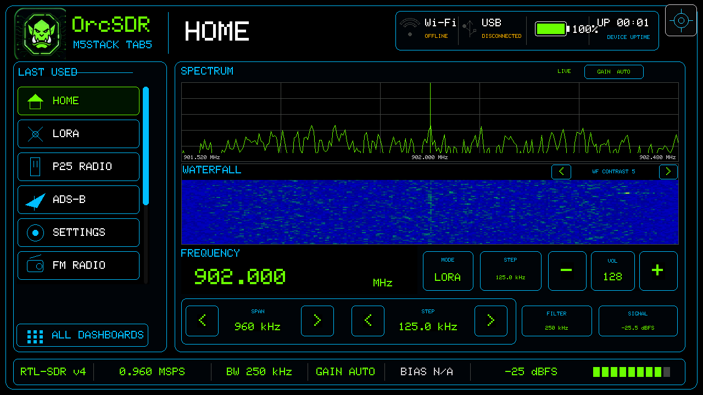
</p>

The left column is **Last used**. It is a short recency list, not a giant menu: Home, LoRa, P25, ADS-B, Settings, FM, then **All dashboards** if you want the full catalog. Tap a row and you go there. The list updates as you actually use radios, so the thing you were just listening to is one tap away.

The right side is a listen-only scope. You get a live spectrum, a waterfall that fills in over a few seconds, the current frequency, the current mode, step size, volume, span, filter bandwidth, and a signal meter. The status strip along the bottom tells you the dongle is an RTL-SDR v4, the sample rate, bandwidth, gain, bias-tee, and a dBFS reading.

Home is deliberately calm about the tuner. It does **not** walk the local oscillator every second to keep the plot looking busy. Walking the LO used to chop the audio and freeze the scope. Home now stays on the frequency you left it on, draws the spectrum from that stream, and lets you listen. The last FM station is saved as the channel you tuned, not as a 13 kHz LO command, so a power-button restart comes back to Home on that station.

If you want to hunt a new signal, open the dashboard for that band. Home is for “leave it on and look at the air.”

<p align="center">
  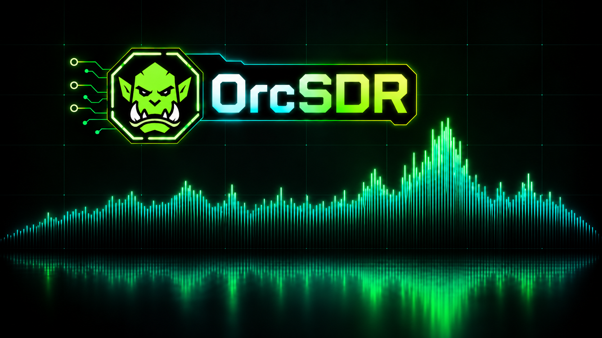
</p>

The splash is the loading screen, not a dashboard. It loops while Wi-Fi, the RTL-SDR host, and saved settings come up. The **OrcSDR** button appears when the radio is actually ready. Tap it and you are on Home.

---

### FM Broadcast

FM is the dashboard people will use the most. It is a broadcast radio with a spectrum, RDS, and a health page, not a generic tuner with an FM label. Open it from Home, and the last station you were on is still the station.

#### Listen

<p align="center">
  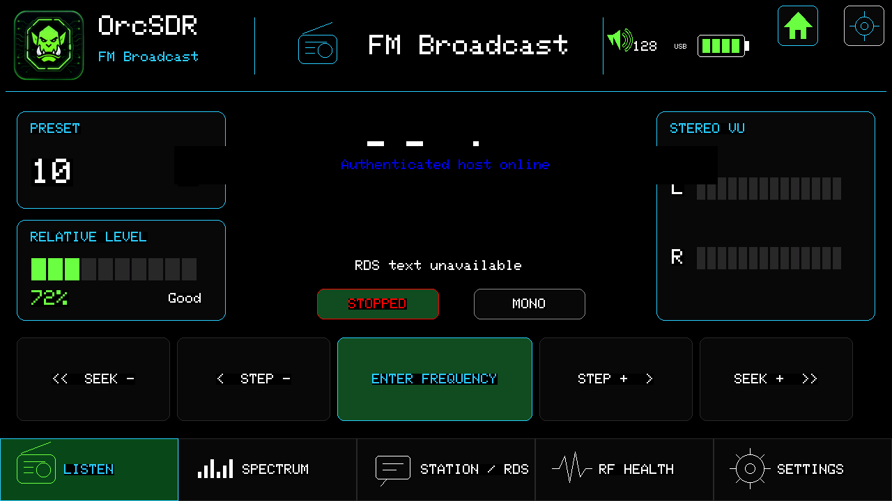
</p>

Listen is the car-radio page. You see the current preset, a relative signal bar, stereo left/right VU meters, and a row of big buttons: **Seek −**, **Step −**, **Enter frequency**, **Step +**, **Seek +**.

What you actually do here:

- **Step** moves one channel at a time. This is the reliable way to walk the dial.
- **Seek** hunts for the next station that looks strong enough to stop on.
- **Enter frequency** opens a keypad so you can punch in 104.7 instead of stepping there.
- Volume lives in the header. The VU meters tell you whether you actually have stereo audio, not just a carrier.

RDS text shows up in the middle once the decoder has a lock. Until then it says the text is unavailable, which is honest: RDS takes a few seconds of clean groups, not a single frame.

#### Spectrum

<p align="center">
  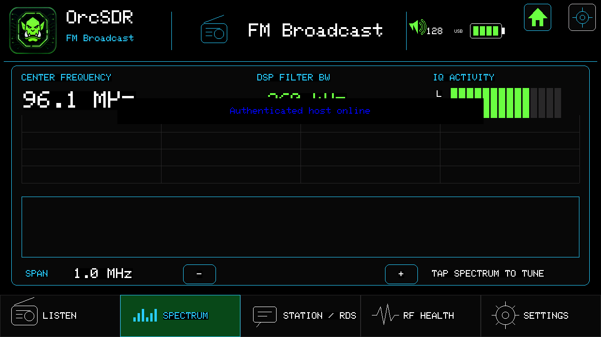
</p>

Spectrum is for seeing the neighborhood around the station. The center frequency, DSP filter bandwidth, and IQ activity sit on top. The plot is a live span of the FM band around where you are tuned. **Tap the spectrum to tune** — if you see a peak next door, you tap it instead of guessing a number. Span **−** / **+** zooms the window. This is the page you use when you know there is a station “around 96” and you want to put the tuner on the peak you can see.

#### Station / RDS

<p align="center">
  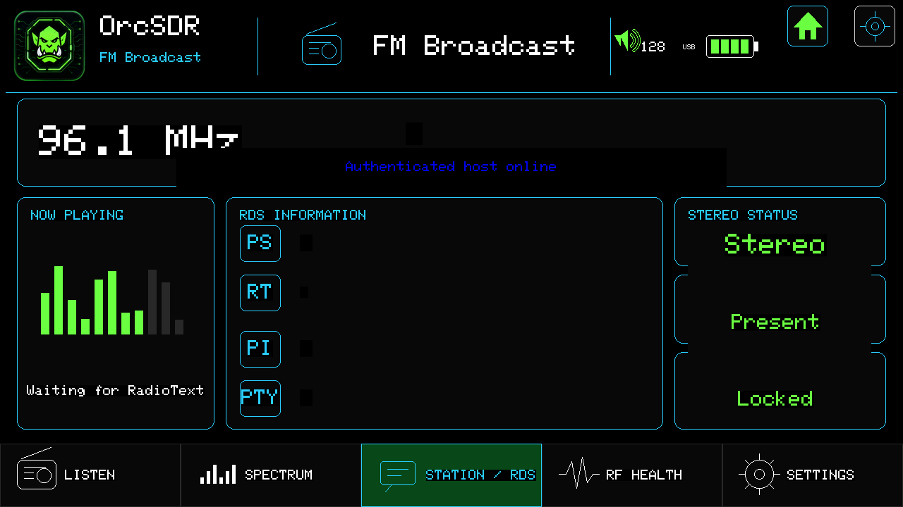
</p>

This is the page that makes FM feel like a real radio. Once the decoder locks, you get:

- **PS** — the short station name, confirmed across repeated group A slots so a one-shot glitch does not rename the station
- **RT** — Radio Text, the scrolling “now playing” line when the station sends it
- **PI** — the station’s program identifier
- **PTY** — program type, voted from repeated groups so a single bad group does not flip Classical to something else
- **Stereo status** — whether the pilot is present and locked

RDS is live on air: groups are accepted in A–B–C–D order, PS slots have to confirm, PTY is a vote, and Radio Text comes from the winning lock. Weak stations take longer. That is expected. Sit on the station for a few seconds and watch the fields fill in.

#### RF Health

<p align="center">
  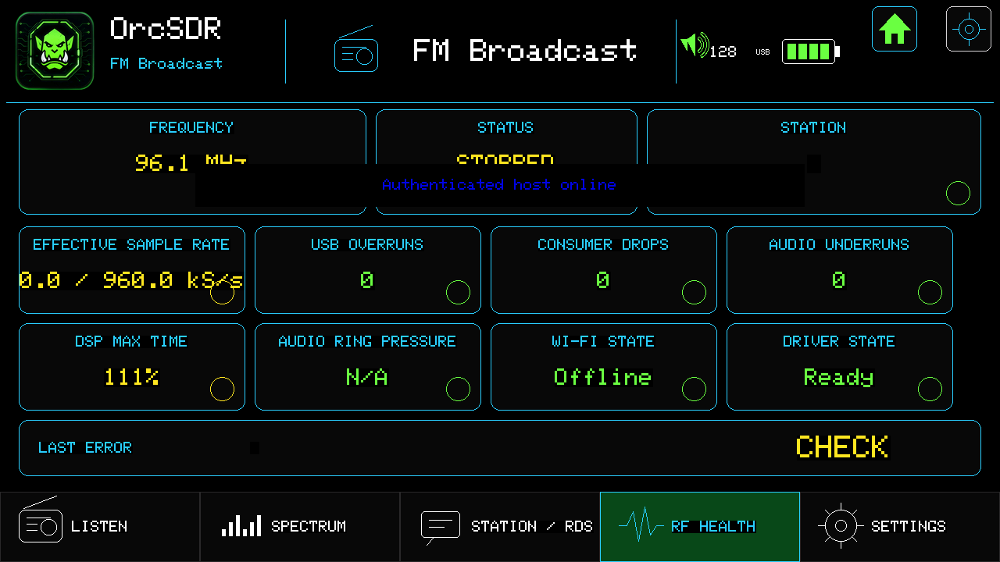
</p>

RF Health is the “is the radio actually healthy?” page. You get the tuned frequency, stream status, effective sample rate versus the 960 kS/s target, USB overruns, consumer drops, audio underruns, DSP max time, Wi-Fi state, and driver state. If music stutters, this is the first place to look: a climbing overrun or underrun count means USB or audio is falling behind, not that the station vanished.

#### FM Settings

<p align="center">
  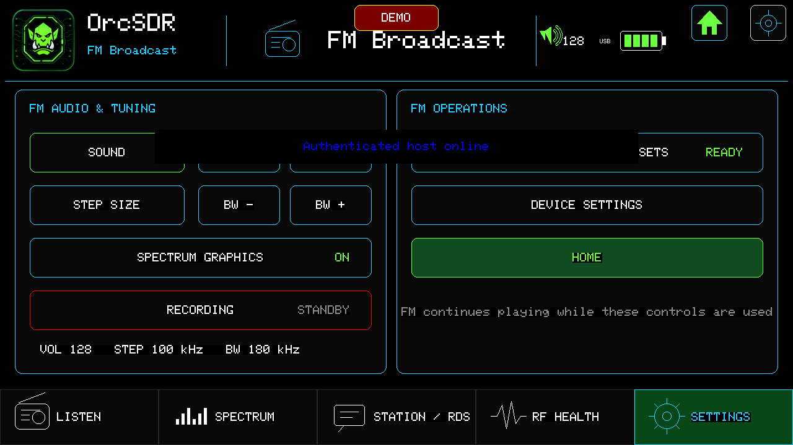
</p>

FM Settings stay on the station while you use them. Sound on/off, step size, filter bandwidth, spectrum graphics, and recording standby live on the left. Device settings and a big **Home** button live on the right. The point of this page is small radio preferences without dumping you into the global Settings app.

---

### P25 Trunking

P25 is for following a public-safety trunked system with one tuner. You load a system profile, park on a control channel, and let the radio follow voice grants it can hear. Encrypted voice is not decoded; the firmware can skip those grants and keep looking.

#### Monitor

<p align="center">
  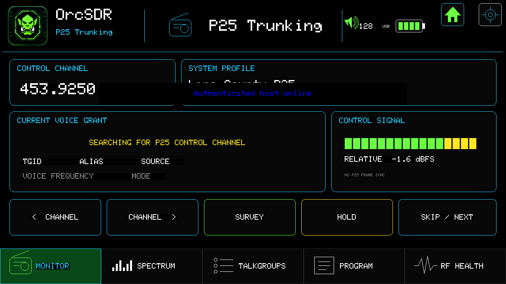
</p>

Monitor is the live scanner view. The control channel frequency is on the left. The current voice grant — talkgroup ID, alias, source, voice frequency, mode — fills in when the system actually grants a call. A control-signal meter shows whether the control channel is even there.

The buttons are the ones you use with your thumb:

- **Channel − / +** walks control channels in the programmed list
- **Survey** looks across the site’s control channels for the one that is actually up
- **Hold** sticks on the current talkgroup so a long call does not get lost
- **Skip / Next** dumps the current grant and goes back to hunting

When nothing is granted yet, the page says it is searching. That empty state is the radio working, not a broken screen.

#### Spectrum

<p align="center">
  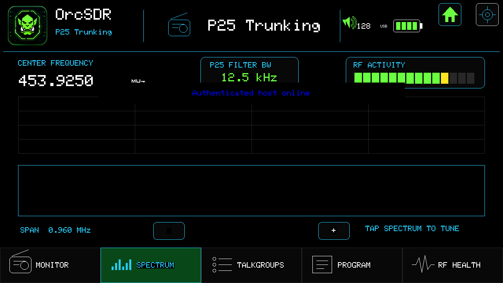
</p>

Same idea as FM spectrum, but with a 12.5 kHz P25 filter and a narrower span. Tap a peak to put the tuner there. Use this when you know the site is nearby but you are not sure which control channel is loudest.

#### Talkgroups

<p align="center">
  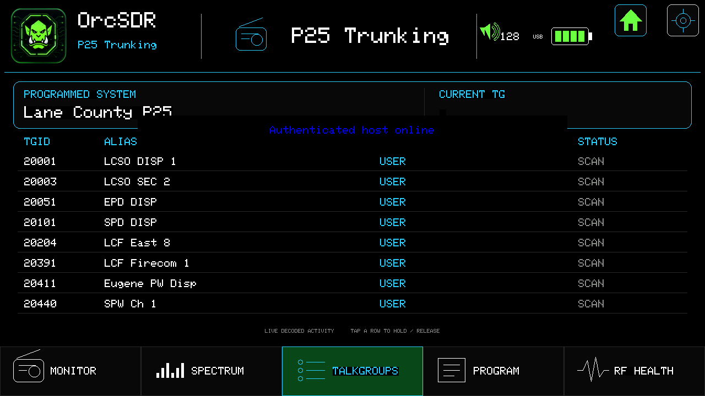
</p>

Talkgroups is the roster for the programmed system. Each row is a TGID, an alias (for example a dispatch or fire channel), and whether it is in the scan list. Tap a row to hold or release that talkgroup. This is the page you use when you hear a call and want to pin it, or when you only care about one agency on a busy site.

#### Program

<p align="center">
  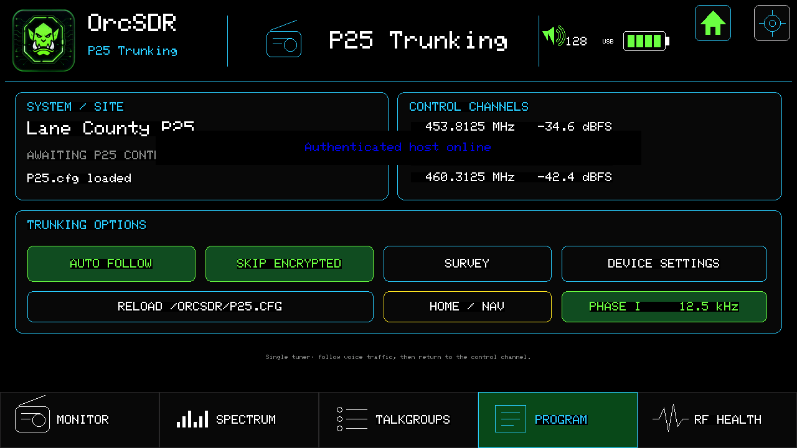
</p>

Program is how the radio knows which system you mean. A `p25.cfg` on the SD card names the site and its control channels. You can reload that file, turn **Auto follow** on so voice grants are chased and then the tuner returns to the control channel, and **Skip encrypted** so encrypted grants do not stall the scan. The footer is the honest constraint of a single dongle: follow voice, then go back to the control channel. There is no second tuner.

#### RF Health

<p align="center">
  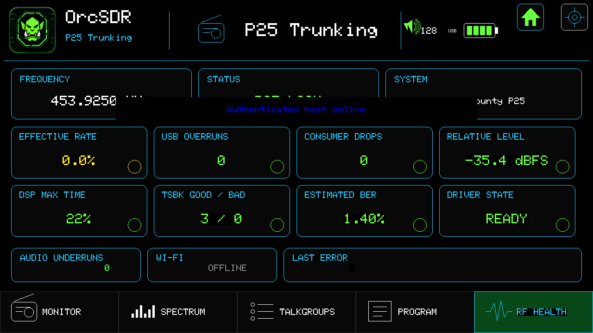
</p>

P25 health adds trunking-specific numbers on top of the USB/DSP meters: TSBK good versus bad, estimated bit error rate, relative level. If the control channel is visible on the meter but BER is high, you need a better antenna or a closer site, not a different button.

---

### ADS-B

ADS-B is the 1090 MHz aircraft dashboard. It is a radar plot, a list, a target card, and a stats page. Receiver location and radar range come from Settings so range/bearing have somewhere to be measured from.

The captures below were taken with the **DEMO** badge on, using the built-in sample aircraft (DAL123 and friends). That is a documentation/demo path so the screens have something to show when the sky is empty. On a live dongle with an antenna, the same screens fill with real Mode-S traffic.

#### Radar

<p align="center">
  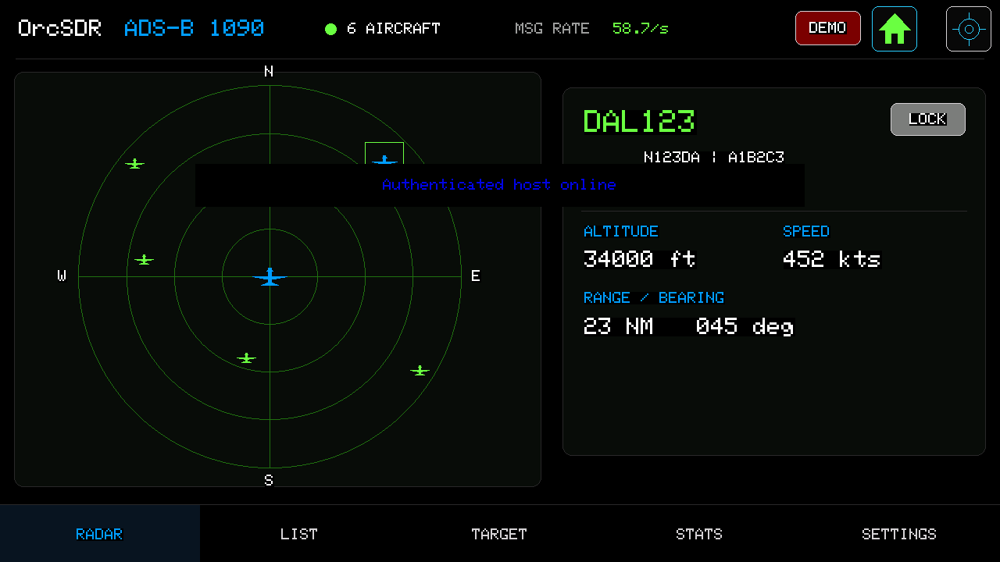
</p>

Radar is the “look up” page. Your receiver is the center of a polar plot. Aircraft are plotted by bearing and range. Tap one to lock it. The right card shows callsign, ICAO, altitude, speed, range, and bearing. The header shows how many aircraft are known and the current message rate.

#### List

<p align="center">
  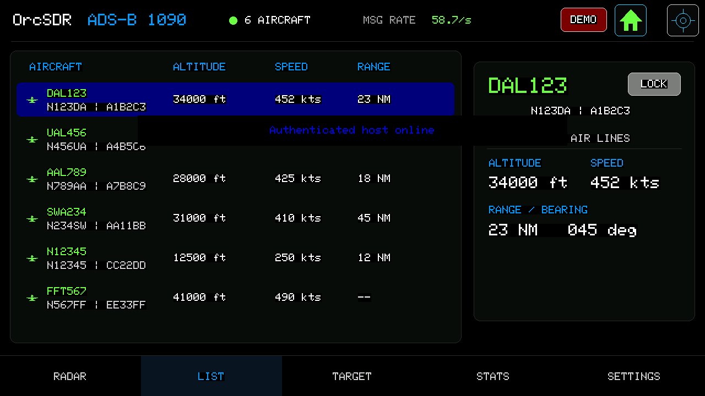
</p>

List is the same traffic as a table: callsign, tail / ICAO, altitude, speed, range. Select a row and the detail card updates. **Lock** keeps that aircraft selected while others come and go. Use List when you care about a specific flight more than the pretty plot.

#### Target

<p align="center">
  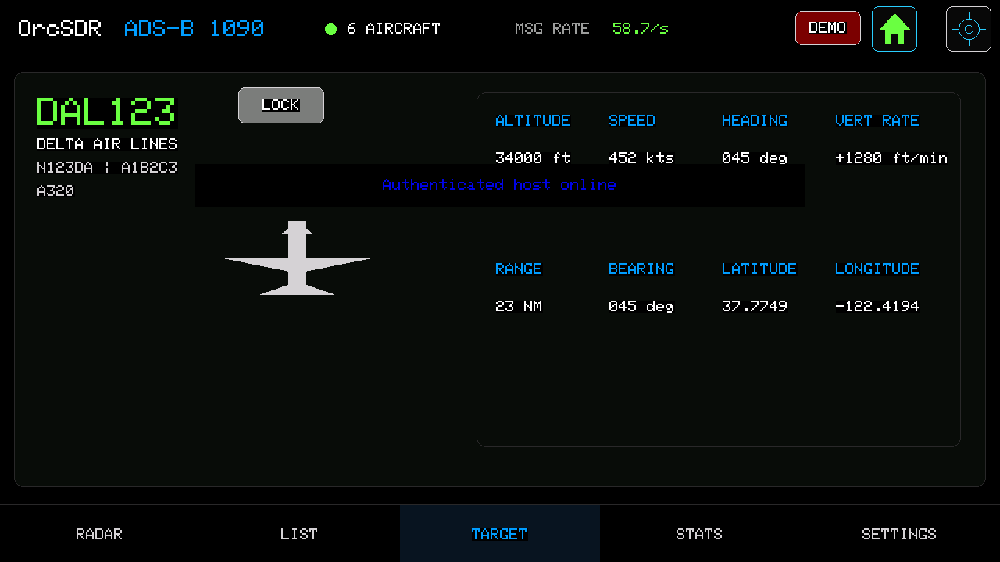
</p>

Target is the full card for one aircraft: airline, type, altitude, speed, heading, vertical rate, range, bearing, latitude, longitude. This is the page you leave up when you have locked something interesting and want the numbers without the rest of the sky competing.

#### Stats

<p align="center">
  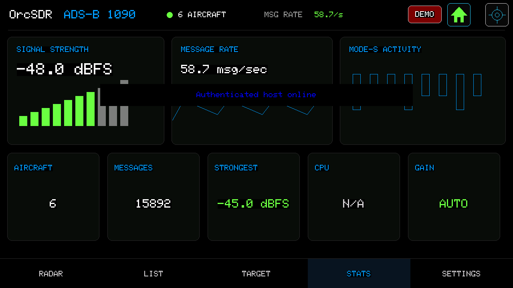
</p>

Stats answers “is 1090 even alive?” Signal strength, message rate over time, Mode-S activity, aircraft count, total messages, strongest burst, and gain (automatic). If the radar is empty, Stats tells you whether the decoder is quiet or you simply have no aircraft in range.

#### ADS-B Settings

<p align="center">
  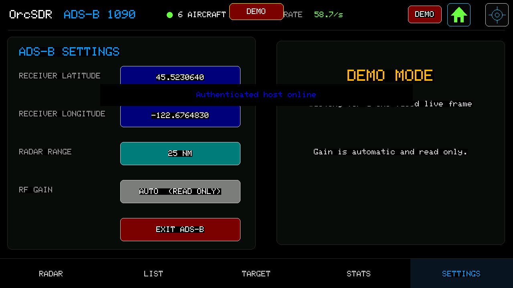
</p>

Set the receiver lat/lon and radar range here (or from the global Location page). Gain is automatic and read-only on this radio. **Exit ADS-B** returns you to Home.

---

### LoRa Mesh

LoRa Mesh is a **passive Meshtastic receive monitor**. It does not join the mesh, it does not transmit, and it does not pretend to be a node. The dongle sits on the ISM band, the firmware watches for LoRa, and verified traffic shows up as packets, nodes, and (when a position is verified) a map.

The captures below were taken with receive stopped, so Overview, Nodes, Traffic, and Map are honestly empty. That is what the radio looks like before you start RX, or when the band is quiet. Start receive on a live 902–928 MHz antenna and the same pages fill in.

#### Overview

<p align="center">
  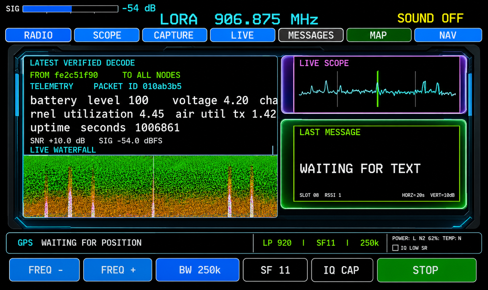
</p>

Overview is the at-a-glance LoRa page. Center frequency, spreading factor, and bandwidth sit in the header (here 906.875 MHz, SF11, 250 kHz). The table is recent verified traffic. **Recent** waits until something actually decodes — it will not invent nodes. Buttons along the bottom: **Scan band**, **Record IQ**, **Channels**, **SD log**. The mode badge is **RX only**.

#### Nodes

<p align="center">
  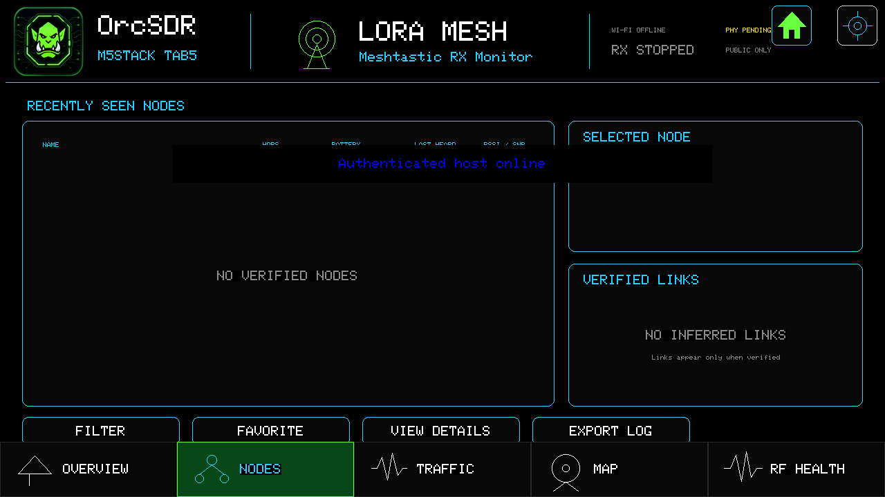
</p>

Nodes is the roster of radios the decoder has actually verified. Pick one to see details. Verified links only appear when the firmware can infer them from traffic, not from a guess. **Filter**, **Favorite**, **View details**, and **Export log** are how you keep a busy mesh readable.

#### Traffic

<p align="center">
  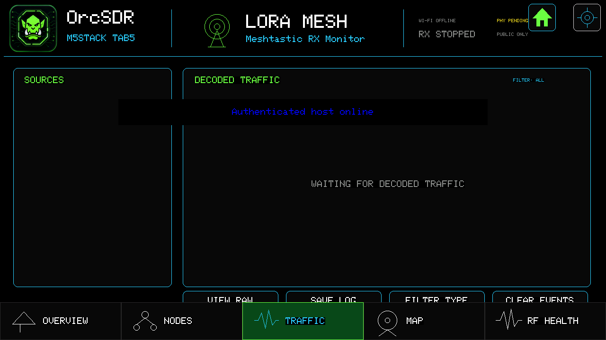
</p>

Traffic is the message log. Sources on the left, decoded traffic on the right, with a type filter. This is the page you leave up if you care about what was said, not just that a node exists. You can view raw, save a log, filter by type, and clear the buffer.

#### Map

<p align="center">
  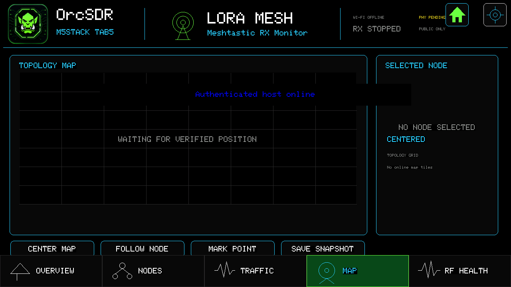
</p>

Map is a topology grid for nodes that have a **verified position**. It does not pull online map tiles. Until a node has sent a position the firmware trusts, you get “waiting for verified position.” **Center map**, **Follow node**, **Mark point**, and **Save snapshot** are for when that data exists.

#### RF Health

<p align="center">
  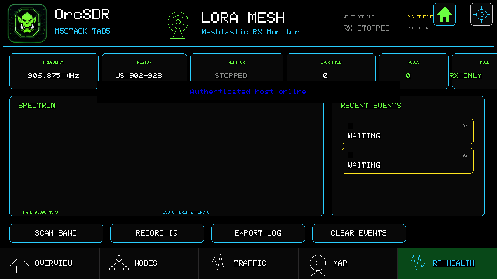
</p>

LoRa health shows frequency, region (US 902–928), whether the monitor is running, encrypted count, node count, and RX-only mode, plus a spectrum and a recent-events list. **Scan band**, **Record IQ**, **Export log**, and **Clear events** are the same tools as Overview, on a page that also tells you if USB is dropping samples.

---

### Settings

Settings is the device, not a radio. Open it from Home when you want Wi-Fi, a receiver location, brightness, or to see whether the SD card is healthy. Radio audio keeps going while you are in here.

The Settings captures below were taken in a sanitized **DEMO** profile (placeholder SSIDs and a documentation build). Your live device shows your own networks, battery, and SD card.

#### Connectivity

<p align="center">
  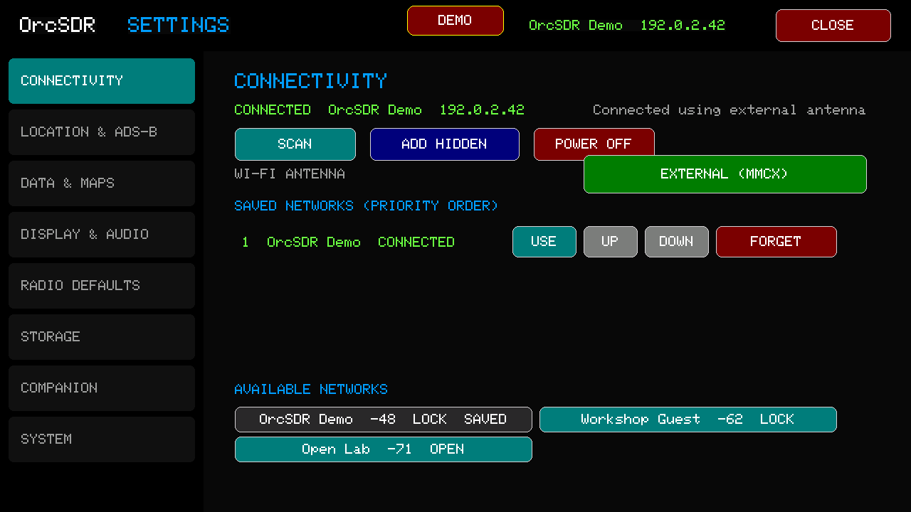
</p>

This is how the Tab5 gets on a network. Scan, add a hidden SSID, power the radio off, pick the Wi-Fi antenna (external MMCX on the Tab5), and manage a priority list of saved networks. OrcSDR does not need Wi-Fi to listen to FM. Wi-Fi is for maps packs, companion pages, and anything that talks to the LAN.

#### Location & ADS-B

<p align="center">
  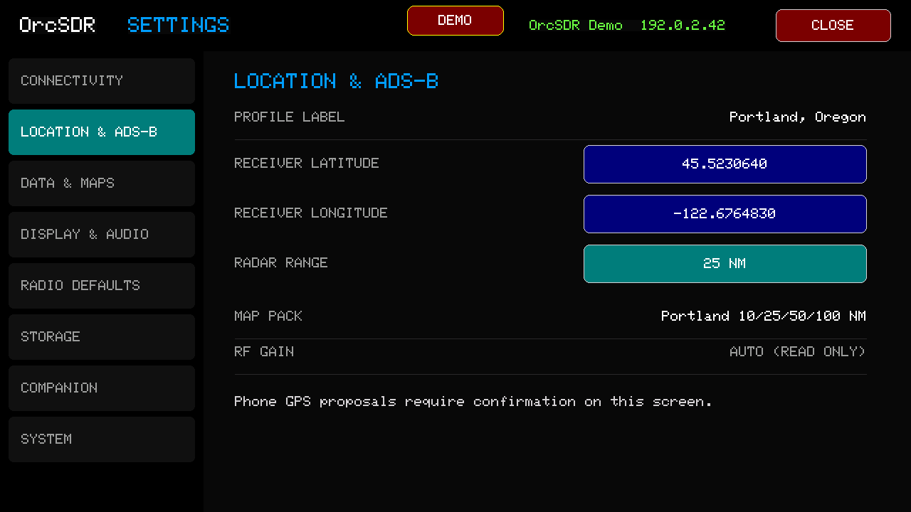
</p>

ADS-B range and bearing are only as good as this page. Set a profile label, receiver latitude and longitude, radar range, and which map pack to use. Phone GPS proposals have to be confirmed here; the radio does not silently relocate itself.

#### Data & Maps

<p align="center">
  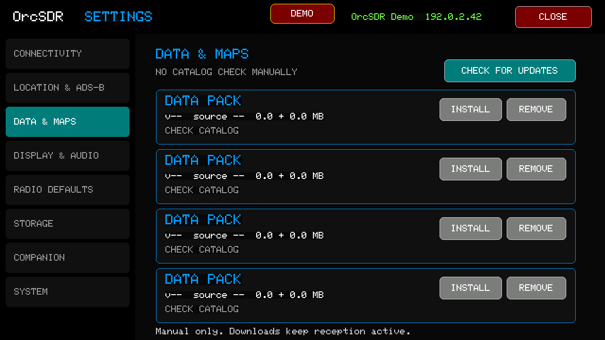
</p>

Optional data packs (maps and related databases) install from a catalog you check manually. Downloads are designed to keep reception active. Nothing here is required to listen to FM.

#### Display & Audio

<p align="center">
  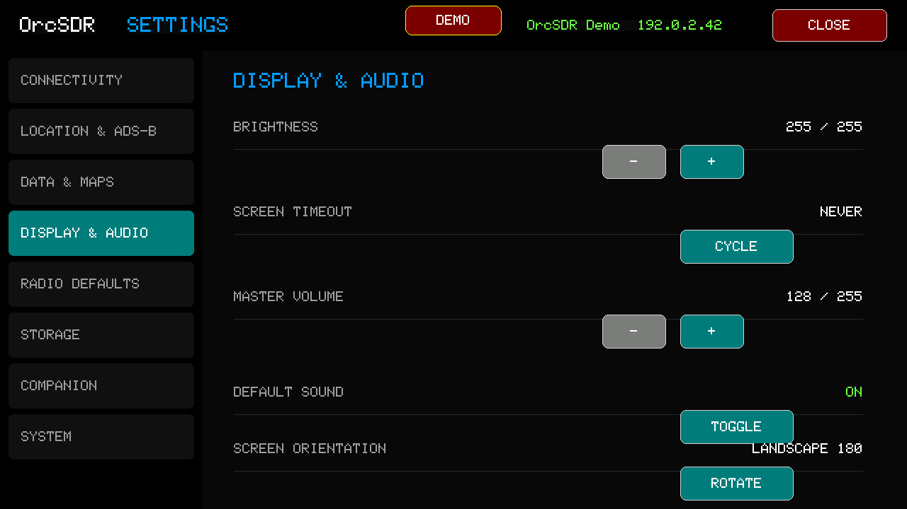
</p>

Brightness, screen timeout (including never), master volume, whether UI sounds play, and screen orientation. This is the page you use in a dark room or when the Tab5 is on its side on the bench.

#### Radio Defaults

<p align="center">
  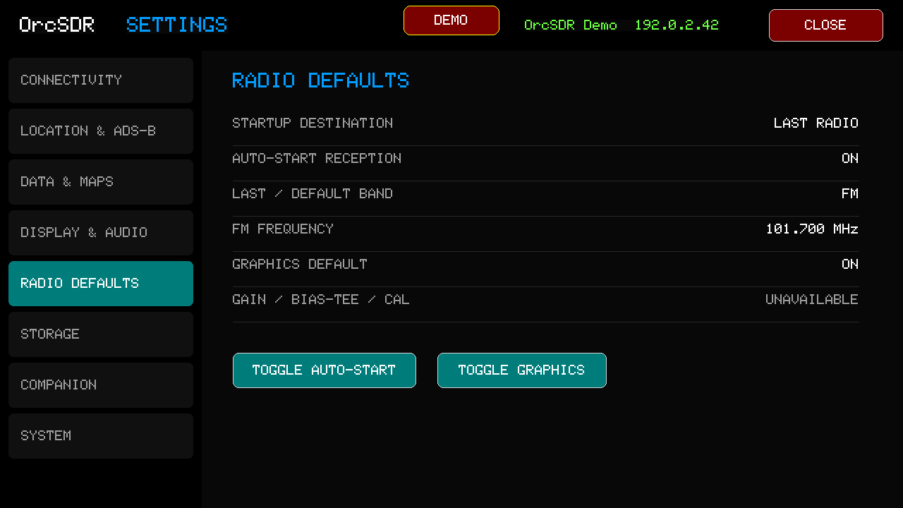
</p>

This is the “what happens when I turn it on?” page. Startup can go to the last radio. Auto-start reception can be on. Last/default band and last FM frequency are remembered. Spectrum graphics can default on or off. Gain / bias-tee / cal stay with the driver when they are not a user control.

#### Storage

<p align="center">
  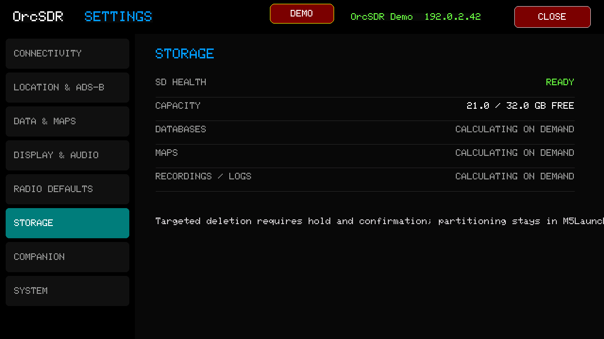
</p>

SD health, free space, and on-demand sizes for databases, maps, and recordings. Targeted deletion requires a hold-and-confirm; partitioning stays in the M5 launcher. Back up recordings before you flash a new alpha.

#### Companion

<p align="center">
  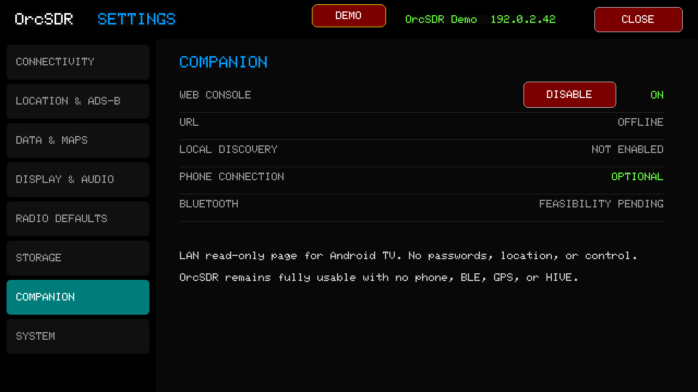
</p>

Companion is optional. There is a LAN read-only web console intended for something like an Android TV, with no passwords, location, or remote control. Phone connection is optional. Bluetooth speaker audio is not available on the Tab5 C6. **OrcSDR remains fully usable with no phone, BLE, GPS, or extra host software.**

#### System

<p align="center">
  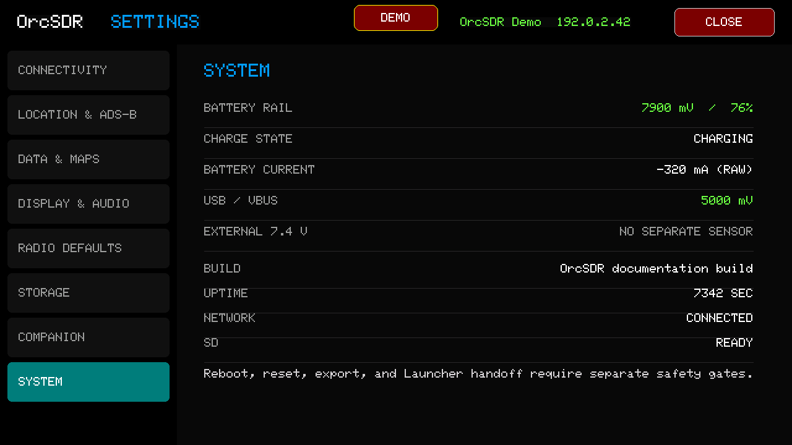
</p>

Battery rail and charge, USB / VBUS, build identity, uptime, network, SD. Reboot, reset, export, and launcher handoff stay behind separate safety gates so a tap in Settings cannot brick a session.

<p align="center">
  <strong>Ready to run this on a Tab5?</strong><br>
  <a href="#-flash-orcsdr-to-the-m5stack-tab5">Flash OrcSDR →</a>
</p>

---

# 🚀 Flash OrcSDR to the M5Stack Tab5

> [!IMPORTANT]
> **Fastest path to running OrcSDR on real hardware**
>
> Reference hardware: **M5Stack Tab5 + RTL-SDR Blog V4**

### Requirements

- **M5Stack Tab5**
- **RTL-SDR Blog V4**
- **Espressif ESP-IDF 5.5.4 for Windows**
- **ESP-Hosted 3.0.6 C6 firmware** for the Tab5 C6
- USB cable for flashing the Tab5
- USB connection from the Tab5 USB Host port to the RTL-SDR
- Antenna appropriate for what you want to receive

Keep the RTL-SDR disconnected while you flash. Plug it into the Tab5 USB Host port after the P4 image is on the device.

### 1. Clone OrcSDR

```bash
git clone https://github.com/hardcoreerik/OrcSDR.git
cd OrcSDR
```

If you already have OrcSDR cloned:

```bash
cd OrcSDR
git pull
```

A tagged hardware-testing snapshot lives at `v0.2.0-alpha.5` if you want a known cut instead of `main`. See [`docs/releases/v0.2.0-alpha.5.md`](docs/releases/v0.2.0-alpha.5.md).

### 2. Find the Tab5 port

Connect the Tab5 to your computer over USB and run:

```powershell
Get-CimInstance Win32_SerialPort | Select-Object DeviceID, Name
```

On Windows, note the assigned COM port. For example:

```text
COM8
```

### 3. Install OrcSDR

ESP-IDF 5.5.4 must already be installed. Use the explicit native build steps in
[the Tab5 ESP-Hosted migration record](docs/user-guide/tab5-esp-hosted-3-migration.md),
not the legacy installer as a release gate.

```powershell
Set-Location .\apps\orcsdr-tab5
$env:IDF_PYTHON_ENV_PATH = 'C:\Espressif\python_env\idf5.5_py3.14_env'
. 'C:\Espressif\frameworks\esp-idf-v5.5.4\export.ps1'
idf.py reconfigure
idf.py build
```

The legacy script is retained for historical releases and still expects the
old 2.12.6 pair. It is not valid 3.0.6 acceptance tooling. A P4 application
flash cannot update the C6.

Saved NVS settings are preserved. PlatformIO is not a supported OrcSDR build or flash path.

A matching boot line looks like:

```text
I OrcSDR: ESP32-C6 detected
I OrcSDR: ESP-Hosted C6 FW: 3.0.6
I OrcSDR: ESP-Hosted transport: SDIO
```

### 4. Connect the RTL-SDR Blog V4

```text
M5Stack Tab5
     │
 USB Host
     │
     ▼
RTL-SDR Blog V4
     │
 RF Input
     │
     ▼
  Antenna
```

Power-cycle or reset the Tab5 after flashing if needed. Unplug the PC USB Serial/JTAG cable for living-room use so the tablet is just a radio.

> [!NOTE]
> OrcSDR is under active development. Some radio modes, DSP paths, and controls are experimental and may change between releases. Encrypted P25 voice is not decoded. Bluetooth speaker audio is not available on the Tab5 C6. Hardware still varies with power, USB devices, antennas, and local RF.

---

## Hardware

| Component | Hardware |
| --- | --- |
| MCU | **ESP32-P4** |
| Reference device | **M5Stack Tab5** |
| SDR | **RTL-SDR Blog V4** |
| Interface | USB Host |
| USB VID:PID | `0bda:2838` |
| USB manufacturer | `RTLSDRBlog` |
| USB product | `Blog V4` |

The **ESP32-P4 High-Speed USB Host** is the measured reference target.

ESP32-S2 and ESP32-S3 support is **not currently claimed** until those platforms have been measured and validated.

---

## Repository Layout

```text
OrcSDR/
├── apps/
│   └── orcsdr-tab5/             M5Stack Tab5 SDR application
│
├── components/                   OrcSDR-owned supporting components
│
├── docs/                        Technical documentation and dashboard captures
│
├── tools/                       Capture, transfer, analysis, and test tools
│
├── install-orcsdr.ps1           Historical installer (2.12.6 check; not the 3.0.6 release gate)
├── LICENSE
└── README.md
```

Application notes for the Tab5 firmware live in [`apps/orcsdr-tab5/README.md`](apps/orcsdr-tab5/README.md).

---

# `esp_rtl_sdr`

OrcSDR consumes the standalone [`esp_rtl_sdr`](https://github.com/hardcoreerik/esp-rtl-sdr)
ESP-IDF USB Host driver for the **RTL-SDR Blog V4**.

The Tab5 firmware pins the immutable `v0.7.9` GitHub release in its component
manifest and committed ESP-IDF lockfile. The driver is not copied into this
repository and `managed_components` remains generated and untracked.

OrcSDR explicitly uses callback-only IQ delivery, three 32-KiB transfers, and
USB core 0:

```cpp
#include "esp_rtl_sdr.h"

esp_rtl_sdr_config_t cfg;
esp_rtl_sdr_config_default(&cfg);
cfg.delivery_mode = ESP_RTL_SDR_DELIVERY_CALLBACK;
cfg.transfer_bytes = 32768;
cfg.transfer_count = 3;
cfg.usb_task_core_id = 0;
```

See [`docs/API_ESP_RTL_SDR.md`](docs/API_ESP_RTL_SDR.md) for OrcSDR's pinned-driver contract. The complete public API lives in the driver repository; integration notes live in [`docs/PORTING.md`](docs/PORTING.md).

### Device identity

The driver currently accepts the measured RTL-SDR Blog V4 identity:

```text
VID:          0bda
PID:          2838
Manufacturer: RTLSDRBlog
Product:      Blog V4
```

### Target support

| MCU | USB Host | Status |
| --- | --- | --- |
| **ESP32-P4** | High-Speed | ✅ Measured reference platform |
| ESP32-S3 | Full-Speed | ⚠️ Not currently claimed |
| ESP32-S2 | Full-Speed | ⚠️ Not currently claimed |

### Clean-room implementation

`esp_rtl_sdr` is a **clean-room implementation** of the USB behavior required to operate the RTL-SDR Blog V4. It is not derived from `librtlsdr` source. Measured behavior lives in [`docs/RTL_SDR_V4_CLEAN_ROOM_SPEC.md`](docs/RTL_SDR_V4_CLEAN_ROOM_SPEC.md).

---

## Architecture

```text
                         OrcSDR
                            │
                ┌───────────┴───────────┐
                │                       │
          Tab5 Touch UI            Radio / DSP
                │                       │
                └───────────┬───────────┘
                            │
                     RTL-SDRv4-ESP
                            │
                     ESP-IDF USB Host
                            │
                       USB High-Speed
                            │
                    RTL-SDR Blog V4
                            │
                           RF
```

---

## Development Roadmap

OrcSDR is moving from a working reference radio toward a more reusable embedded SDR platform. Current work includes:

- Soak and harden USB streaming and unplug/replug recovery
- Improve FM audio quality and RDS lock time on weak stations
- Finish remaining radio shells (AM, WX, CB, wide browse) to the same dashboard quality as FM / P25 / LoRa
- Keep separating radio logic from the Tab5 UI
- Validate additional ESP32-P4 USB Host boards
- Build reusable examples around `RTL-SDRv4-ESP`

Engineering notes:

- [`docs/PORTING.md`](docs/PORTING.md)
- [`docs/M5TAB5_RTL_RADIO_NEXT_STEPS.md`](docs/M5TAB5_RTL_RADIO_NEXT_STEPS.md)
- [`docs/FM_DSP_CAPTURE_LAB.md`](docs/FM_DSP_CAPTURE_LAB.md)
- [`docs/TAB5_BUILD_POLICY.md`](docs/TAB5_BUILD_POLICY.md)

---

## Why ESP32-P4?

The ESP32-P4 is an interesting platform for standalone SDR because it combines High-Speed USB, more processing than earlier ESP32 devices, display-oriented peripherals, and enough headroom to run USB radio, DSP, graphics, audio, and touch on one chip.

The goal is not to reproduce a desktop SDR workstation on an ESP32. The goal is to make **useful, portable, self-contained radio appliances** with inexpensive SDR hardware.

---

## The Orc Ecosystem

OrcSDR is part of the broader **Orc Ecosystem** — local AI, embedded radio, mesh networking, and custom hardware/software that can run without a cloud in the loop.

- **[TheOrc](https://github.com/hardcoreerik/TheOrc)** — local-first multi-agent AI orchestration and distributed compute.
- **[OrcSDR](https://github.com/hardcoreerik/OrcSDR)** — embedded software-defined radio and RTL-SDR V4 tooling.
- **[OrcMesh](https://github.com/hardcoreerik/OrcMesh)** — LoRa, Meshtastic, MeshCore, and distributed embedded mesh networking.

Each project is useful on its own. The larger direction is devices that can communicate, observe their RF environment, process data locally, and cooperate.

---

## Contributing

Contributions are welcome in USB Host, DSP, spectrum/waterfall, radio UI, hardware testing, USB traces, V4 behavior documentation, radio modes, test tooling, and docs.

When contributing to the RTL-SDR V4 driver, preserve the clean-room rules and document the source of any device behavior or measurements.

---

## License

OrcSDR is licensed under **AGPL-3.0-only** by default.

See [`LICENSE`](LICENSE) and [`LICENSING.md`](LICENSING.md).

Commercial licensing terms are also available from the maintainer.

---

## Project Links

**Repository**  
https://github.com/hardcoreerik/OrcSDR

**Documentation**  
[User Guide](https://hardcoreerik.github.io/OrcSDR/) · [GitHub Wiki](https://github.com/hardcoreerik/OrcSDR/wiki) · [`docs/`](docs/)

**M5Stack Tab5 Application**  
[`apps/orcsdr-tab5/`](apps/orcsdr-tab5/)

**`esp_rtl_sdr` Driver**
[github.com/hardcoreerik/esp-rtl-sdr](https://github.com/hardcoreerik/esp-rtl-sdr)

**The Orc Ecosystem**  
[TheOrc](https://github.com/hardcoreerik/TheOrc) · [OrcSDR](https://github.com/hardcoreerik/OrcSDR) · [OrcMesh](https://github.com/hardcoreerik/OrcMesh)

---

<p align="center">
  <strong>ESP32-P4 + RTL-SDR Blog V4 + USB High-Speed</strong><br>
  A portable radio that does not ask you to bring a computer.
</p>
