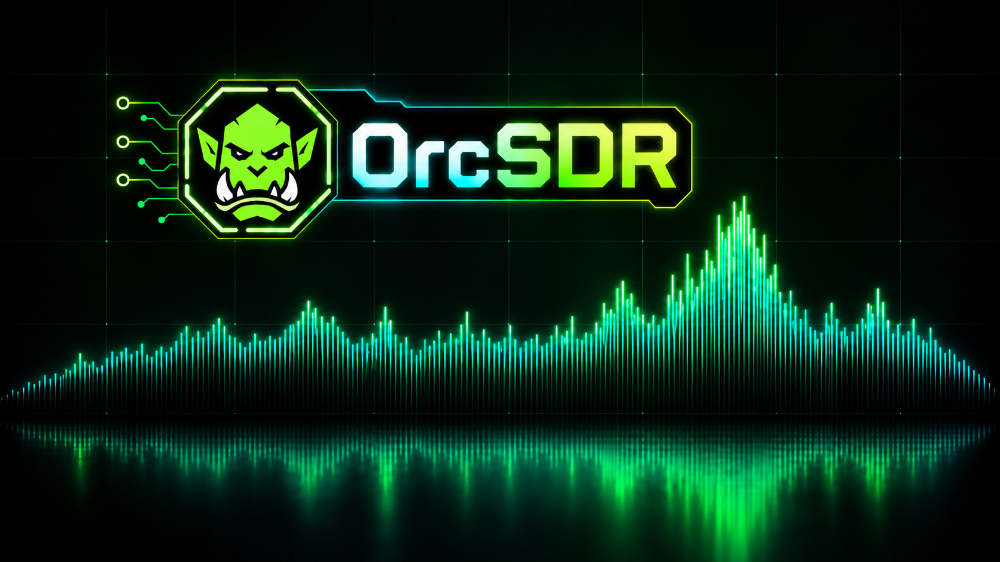
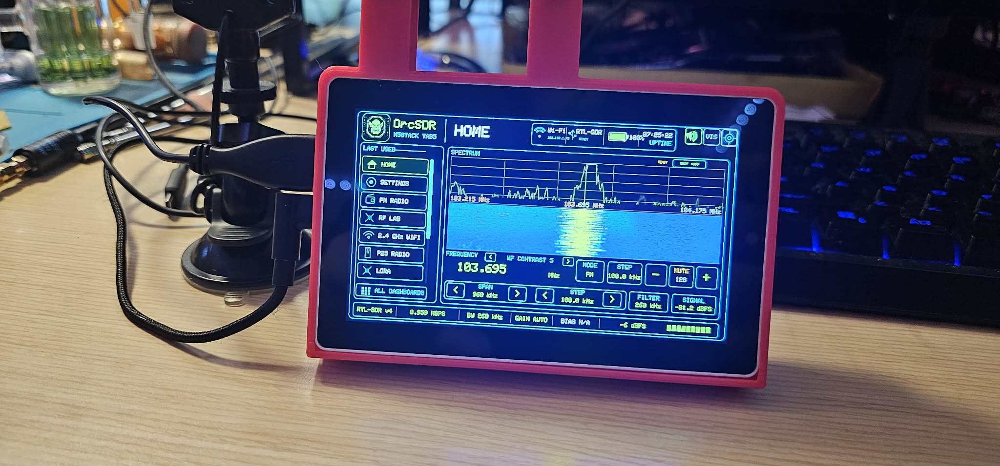
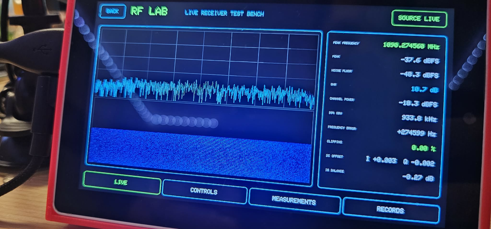
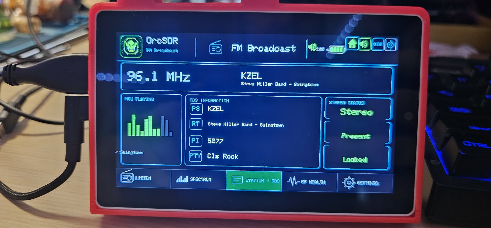
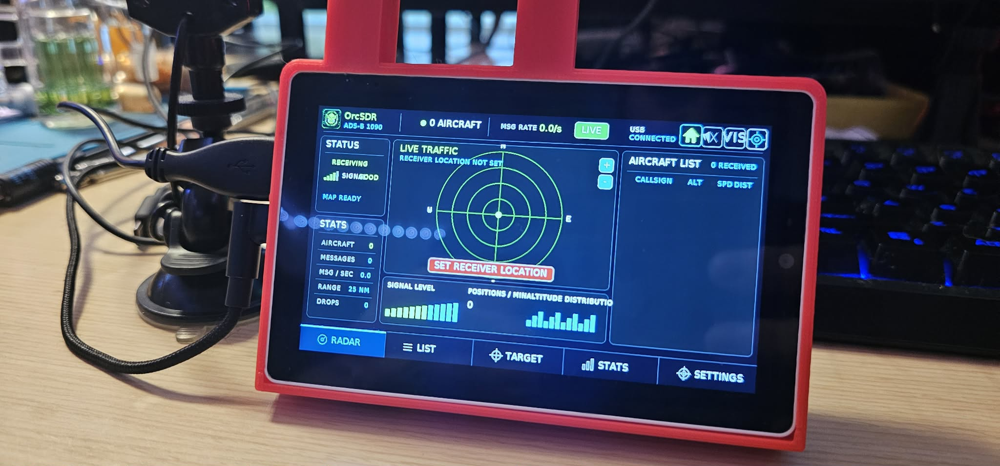
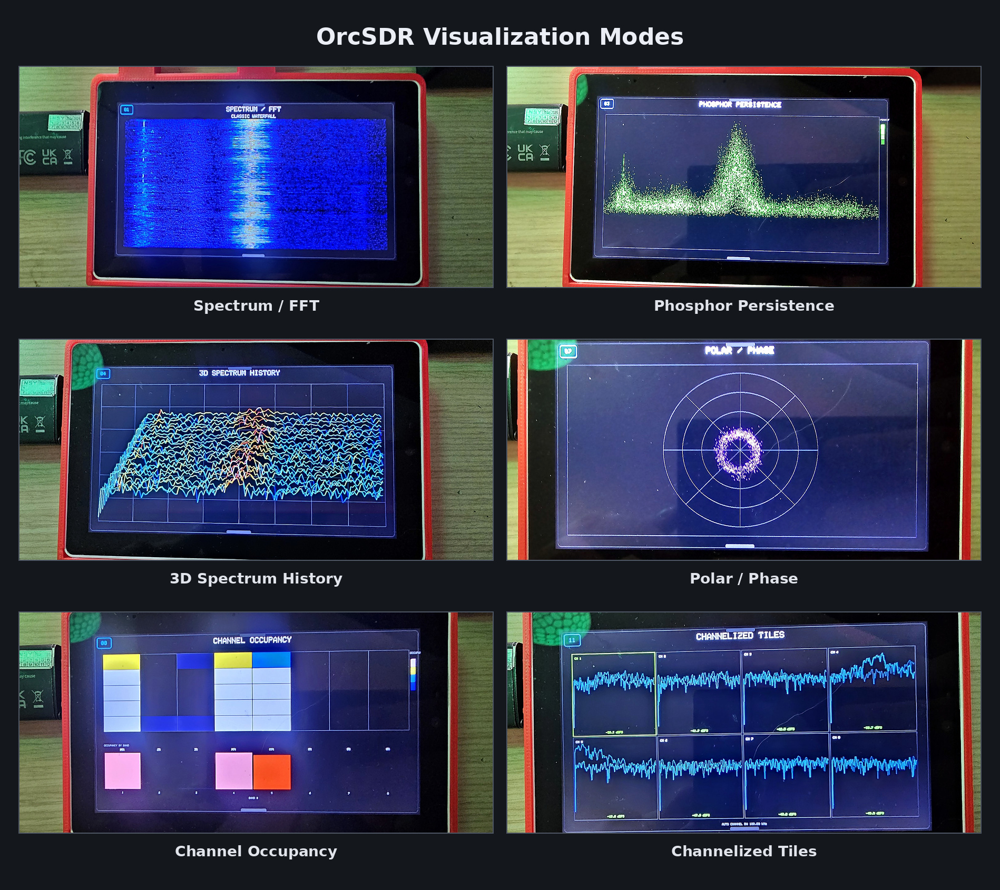

# OrcSDR



**Turn an M5Stack Tab5 and a compatible RTL-SDR receiver into a portable, touchscreen software-defined radio.** OrcSDR runs its radio processing, dashboards, audio, and controls on the Tab5—no laptop, Raspberry Pi, or desktop SDR application is required after installation.

[Download the latest release](https://github.com/hardcoreerik/OrcSDR/releases/latest) · [Install in your browser](https://burner.m5stack.com/share/firmware/JXFU4H) · [Installation guide](docs/user-guide/getting-started.md) · [Read the User Guide](docs/user-guide/index.md) · [Report a bug](https://github.com/hardcoreerik/OrcSDR/issues/new?template=bug_report.md)

## Website, flasher, and builds

OrcSDR is made by Oregon Radio Company LLC, Oregon. Its home is [theorc.dev](https://theorc.dev), and the project has its own [OrcSDR page](https://theorc.dev/sdr/). There's also a [gear guide](https://theorc.dev/guides/) if you're picking out a receiver and antenna.

- **Web flasher:** [theorc.dev/sdr/flash](https://theorc.dev/sdr/flash/) installs the latest release onto an M5Stack Tab5 straight from Chrome or Edge over USB (Web Serial). No tools to install, and your saved settings stay put because NVS isn't erased.
- **Releases:** stable and beta builds are on [GitHub Releases](https://github.com/hardcoreerik/OrcSDR/releases).
- **Nightly builds:** automatic builds of `main` that haven't been tagged yet. They carry changes headed for the next release that have passed testing but not a full release check, so expect the occasional bug. They're published as the rolling GitHub prerelease `nightly`; a web-flash page for nightlies is coming soon on theorc.dev.
- **Contact:** for business inquiries, email [erik@theorc.dev](mailto:erik@theorc.dev).

## Why OrcSDR exists

OrcSDR started with a simple question: **how far can the ESP32-P4 be pushed as an actual software-defined radio host?** The first step was building a clean-room USB driver that let the microcontroller own an RTL-SDR as a native embedded peripheral. Once the Tab5 could sustain the IQ stream itself, that driver became the foundation for a complete radio.

The goal is not to hide a Linux computer behind a touchscreen or reproduce every part of a desktop SDR workstation. It is to build a useful, portable radio appliance: quick to start, touch-first, battery-powered, and able to listen, decode, visualize, scan, and explore signals without another computer attached.

That idea also shapes how OrcSDR is developed. The touchscreen and serial control interface exercise the same radio functions, making repeatable tests and automation part of the product rather than an afterthought. DSP changes are checked with saved captures and replay tools, while receiver controls and RF behavior are verified on physical hardware. Features are described as tested, experimental, or unfinished according to the evidence available.

OrcSDR is an open-source hobby project created by a radio and electronics tinkerer, with extensive AI assistance, outside review, and community testing. AI helps make ambitious work approachable, but the code still has to survive real USB hardware, real antennas, real signals, and repeatable regression tests.

Read the [RTL-SDR Blog feature](https://www.rtl-sdr.com/orcsdr-running-rtl-sdr-directly-on-an-esp32-p4/) for more of the project's story.

## Get started

1. Open the [OrcSDR web flasher](https://burner.m5stack.com/share/firmware/JXFU4H) in **Chrome or Edge**, connect your Tab5 by USB, and click **Burn to device**. Select the Tab5 serial port and follow the instructions. You can also use the M5Burner desktop application. An M5Burner install resets saved settings (Wi-Fi profiles, location, rotation); the [Getting Started guide](docs/user-guide/getting-started.md) explains how to keep them.
2. Restart the Tab5, then connect a supported RTL-SDR receiver to its USB host port.
3. Connect an antenna suitable for the signals you want to receive and choose a dashboard.

Current release images include the matching ESP-Hosted C6 firmware used by the Tab5. Installation, updating, and recovery instructions are in the [Getting Started guide](docs/user-guide/getting-started.md) and [troubleshooting guide](docs/user-guide/troubleshooting.md).

## What OrcSDR does

- **Home:** a full-range VFO. Tune anywhere the receiver reaches with a step that follows the band (FM broadcast, airband, 2 m and 70 cm amateur, marine, CB and more are named in plain words above the spectrum), pick the demodulation (AUTO, NFM, AM, WFM, USB, LSB) from a mode popup with a short explanation of each, type a frequency on a keypad, and watch the live spectrum, waterfall, signal level, receiver status, and recently used dashboards. An optional OrcDial controls the same Home, including span and filter.
- **FM Radio:** receive broadcast FM with stereo audio, RDS station information, presets, and station tuning tools.
- **AM Radio:** receive broadcast AM with region-aware channel steps, presets, automatic tuning, and a full-band station scan.
- **Shortwave:** enter the generic Browse/NFM workspace for experimental HF exploration; calibrated HF and complete AM/SSB modes are not yet available.
- **Weather:** quickly tune the standard NOAA weather-radio channels.
- **Airband:** dedicated receive-only 118–136.975 MHz AM aviation dashboard with 25/8.33 kHz tuning, scan/hold/skip controls, 121.500 guard access, activity history, and offline airport/channel data support. Hardware/RF acceptance remains experimental.
- **Marine:** listen across the standard VHF marine channel plan.
- **CB Radio:** scan all 40 Citizens Band channels at once and stop on whoever is talking, with priority channel, lockouts, activity log, full-band spectrum, and AM/USB/LSB listening.
- **P25 Radio:** monitor trunked P25 control channels and follow supported voice traffic.
- **ADS-B:** receive 1090 MHz aircraft broadcasts and show decoded aircraft, position, altitude, and flight details.
- **LoRa:** passively monitor LoRa and Meshtastic traffic with spectrum, packet, node, traffic, map, and RF-health views.
- **POCSAG:** receive pager traffic and inspect bounded RAM-only CAPCODE/message state. A persistent searchable archive is not implemented.
- **Satellite:** opens generic Browse near 137.5 MHz; no dedicated satellite decoder or dashboard is implemented.
- **RF Lab:** make live RF measurements, inspect receiver behavior, record IQ data, and open full-screen visualization tools.
- **2.4 GHz Wi-Fi:** survey nearby access points, channels, signal strength, and advertised network security using the Tab5 wireless co-processor.
- **Settings:** manage audio, display, Wi-Fi, storage, data packs, firmware information, and device updates.

Feature behavior and current limits are maintained in the [feature status](docs/user-guide/feature-status.md) and [dashboard guides](docs/user-guide/dashboards/fm.md).

## OrcSDR on the Tab5



*OrcSDR running a live FM spectrum and waterfall on the M5Stack Tab5.*

### RF Lab dashboard



RF Lab turns the receiver into a portable test bench with four focused tabs:

- **Live:** shows the spectrum and waterfall beside continuously updated peak frequency, peak power, noise floor, SNR, channel power, 99% occupied bandwidth, frequency error, clipping, DC offset, and I/Q balance.
- **Controls:** provides capability-aware frequency stepping, sample-rate selection, PPM correction, automatic or manual tuner gain, RTL digital AGC, and Bias-T control. Settings can either be kept or restored when leaving RF Lab.
- **Measurements:** takes individual snapshots or timed measurement runs, adds markers, compares readings with an optional reference source and path-loss value, and exposes guided measurement recipes.
- **Records:** shows whether SD storage is available, lists recent measurement sessions and results, and identifies the saved session folders that can be exported through OrcSDR's SD tools.

### FM dashboard



The FM dashboard organizes listening, station information, and diagnostics into five tabs:

- **Listen:** presents the tuned frequency, preset number, relative signal level, station name and radio text, running and stereo state, left/right audio meters, RF gain, seek buttons, frequency steps, and direct frequency entry.
- **Spectrum:** shows a live spectrum and waterfall with center frequency, DSP filter bandwidth, audio/IQ activity, RF gain, adjustable span, step controls, and tap-to-tune interaction.
- **Station / RDS:** expands the currently playing station and decoded RDS fields, including Program Service name, RadioText, PI code, and PTY, alongside stereo, pilot-carrier, and decoder-lock status.
- **RF Health:** reports effective versus requested sample rate, USB overruns, IQ consumer drops, audio underruns, DSP load, audio-buffer pressure, Wi-Fi state, driver state, and the most recent radio error.
- **Settings:** controls sound, volume, tuning step, filter bandwidth, automatic or manual RF gain, spectrum graphics, and recording; it also provides preset scanning/rebuilding, device settings (including **System > SET CLOCK**, which sets the date, time and UTC offset on the device, with an optional network sync), and a return to Home while FM continues playing.

### ADS-B dashboard



The ADS-B dashboard receives Mode-S and ADS-B broadcasts on 1090 MHz and divides aircraft tracking into five tabs:

- **Radar:** shows receiver and map status, aircraft and message totals, message rate, selected range, dropped samples, plotted aircraft positions, a compact aircraft list, signal level, positions per minute, and altitude distribution.
- **List:** provides a browsable set of received aircraft with callsign or registration, ICAO address, aircraft type and operator when known, altitude, speed, range, bearing, vertical rate, and last-seen state.
- **Target:** expands one selected aircraft with identity and registration data, altitude, speed, heading, climb or descent rate, range, bearing, latitude, longitude, last-seen status, and signal level. Installed aviation data can also provide a nearby ATC listening shortcut.
- **Stats:** charts signal strength, message rate, and Mode-S activity; summarizes aircraft, message, sample-rate, and USB/DSP-drop counters; and reports the availability of FAA aircraft data, aviation frequencies, the offline map, and ATC audio.
- **Settings:** sets the receiver location and radar range, shows the active RF-gain state, and manages FAA aircraft data, airport and frequency data, the offline map pack, and manual ATC listening.

## Visualization modes



*A selection of OrcSDR's full-screen RF visualization modes.*

## Receiver support

| Receiver | Status | Notes |
| --- | --- | --- |
| RTL-SDR Blog V4 | Tested baseline | Full OrcSDR receiver path, including the V4 HF upconverter and supported controls. |
| RTL-SDR Blog V3 | Experimental | Provisional operation at 24 MHz and above. Hardware reports and serial logs are welcome. |
| Nooelec NESDR SMArt V5 | Tested | Tested at the same level as the Blog V3c, V4 and V4L (v0.3.0-beta.2 testing on development images built from the driver commits that became esp_rtl_sdr v0.9.3: 453.925 MHz about 46 dB over noise with FM unchanged, five unplug/replug cycles). The earlier check covered 24 MHz and above. On 2026-10-09 the owner also accepted 7.074 MHz FT8 reception using an externally powered MLA-30+; see the [FT8 reception record](docs/user-guide/dashboards/ft8.md). This is not general HF/AM or external-upconverter acceptance. |

Antenna choice affects what can be received. Useful test reports include the receiver model, frequency and band, antenna, gain setting, OrcSDR version, observed behavior, and a serial log when available.

## Technical overview

| Area | Implementation |
| --- | --- |
| Main processor | ESP32-P4 on the M5Stack Tab5; radio control, USB, DSP, graphics, touch, and audio run locally. |
| Display and controls | 1280 × 720 touchscreen interface built with M5Unified and M5GFX. |
| Receiver connection | ESP32-P4 High-Speed USB Host connected directly to a supported RTL-SDR receiver. |
| IQ transport | Callback-only IQ delivery using three 32 KiB USB transfers, with stream and consumer-drop diagnostics. |
| Signal processing | Native on-device demodulation, spectrum and waterfall generation, RF measurements, and protocol decoders. |
| Audio | 48 kHz stereo processing and playback through the Tab5 speaker path. |
| Wireless | The onboard ESP32-C6 provides Wi-Fi over SDIO through ESP-Hosted. The C6 may run 3.0.6 or the M5 factory 2.12.6 (which keeps M5 Launcher's Wi-Fi/OTA working); a 3.0.6 image is embedded for an optional update. |
| Storage | Internal flash and NVS for firmware and settings, plus optional microSD storage for maps, data packs, logs, and IQ captures. |
| Build system | Native ESP-IDF 5.5.4 with locked component versions and repository build/install scripts. |

```text
Antenna → RTL-SDR tuner → High-Speed USB → esp-rtl-sdr → IQ buffers
                                                        ├─ DSP and decoders
                                                        ├─ touchscreen UI
                                                        ├─ speaker audio
                                                        └─ optional storage
```

The standalone [`esp-rtl-sdr`](https://github.com/hardcoreerik/esp-rtl-sdr) component is a clean-room USB host driver. OrcSDR keeps receiver detection and hardware capabilities in the driver while the application owns dashboards, DSP, audio, and user workflows. The current streaming configuration is intentionally fixed at three 32 KiB transfers to preserve the tested hardware baseline.

## Documentation

- [User Guide](docs/user-guide/index.md)
- [Downloads and installation](docs/user-guide/downloads.md)
- [Common controls and workflows](docs/user-guide/shared-controls.md)
- [Settings and Wi-Fi](docs/user-guide/settings.md)
- [Troubleshooting](docs/user-guide/troubleshooting.md)
- [Developer reference](docs/user-guide/reference/developer.md)
- [GitHub Wiki](https://github.com/hardcoreerik/OrcSDR/wiki)

## For developers

Source-build requirements and commands live in the [developer reference](docs/user-guide/reference/developer.md). Driver contracts, porting notes, hardware measurements, and architecture decisions live in the repository's [`docs/`](docs/) directory.

Please keep changes focused and preserve the distinction between a successful build, a successful flash, and physical radio testing. When contributing receiver behavior, document the hardware, test setup, and source of any measurements.

## Project status and support

OrcSDR is under active development. Stable behavior is protected around the RTL-SDR Blog V4 baseline, while other receiver profiles and some digital-radio features remain experimental.

- [Latest release and release notes](https://github.com/hardcoreerik/OrcSDR/releases/latest)
- [Open issues](https://github.com/hardcoreerik/OrcSDR/issues)
- [Discussions](https://github.com/hardcoreerik/OrcSDR/discussions)
- [Contributing and development documentation](docs/)

## License

OrcSDR is licensed under [GNU AGPL-3.0-only](LICENSE), with separate commercial licensing available as described in [LICENSING.md](LICENSING.md).

---

**Hardware:** [M5Stack Tab5](https://docs.m5stack.com/en/core/Tab5) · **Receiver driver:** [`esp-rtl-sdr`](https://github.com/hardcoreerik/esp-rtl-sdr) · **Guide:** [OrcSDR User Guide](docs/user-guide/index.md)

<p align="center">
  <a href="https://theorc.dev"></a>
</p>

<p align="center">
  OrcSDR is made by Oregon Radio Company LLC · <a href="https://theorc.dev">theorc.dev</a> · <a href="mailto:erik@theorc.dev">erik@theorc.dev</a>
</p>
