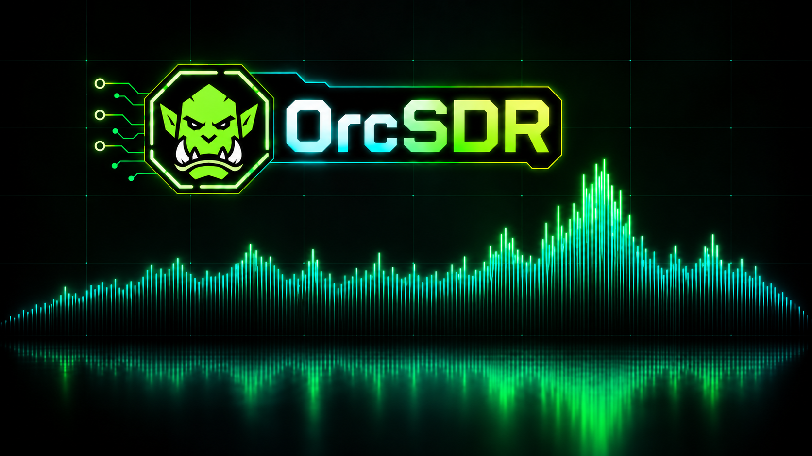
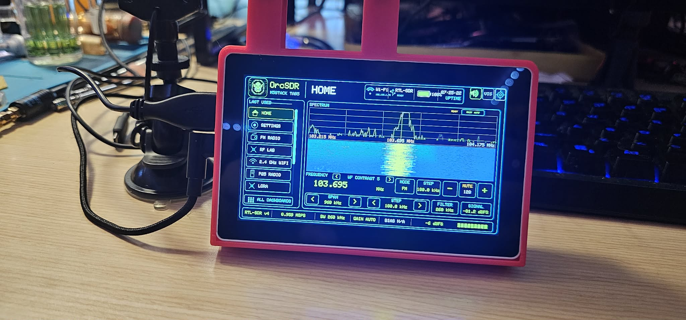

# OrcSDR



**Turn an M5Stack Tab5 and a compatible RTL-SDR receiver into a portable, touchscreen software-defined radio.** OrcSDR runs its radio processing, dashboards, audio, and controls on the Tab5—no laptop, Raspberry Pi, or desktop SDR application is required after installation.

[Download the latest release](https://github.com/hardcoreerik/OrcSDR/releases/latest) · [Install in your browser](https://burner.m5stack.com/share/firmware/JXFU4H) · [Installation guide](docs/user-guide/getting-started.md) · [Read the User Guide](docs/user-guide/index.md) · [Report a bug](https://github.com/hardcoreerik/OrcSDR/issues/new?template=bug_report.md)

## Website, flasher, and builds

OrcSDR is made by Oregon Radio Company LLC, Oregon. Its home is [theorc.dev](https://theorc.dev), and the project has its own [OrcSDR page](https://theorc.dev/sdr/). There's also a [gear guide](https://theorc.dev/guides/) if you're picking out a receiver and antenna.

- **Web flasher:** [theorc.dev/sdr/flash](https://theorc.dev/sdr/flash/) installs the latest release onto an M5Stack Tab5 straight from Chrome or Edge over USB (Web Serial). No tools to install, and your saved settings stay put because NVS isn't erased.
- **Releases:** stable and beta builds are on [GitHub Releases](https://github.com/hardcoreerik/OrcSDR/releases).
- **Nightly builds:** automatic builds of `main` that haven't been tagged yet. [Flash the current nightly in your browser](https://theorc.dev/sdr/nightly/) or view the [rolling GitHub prerelease](https://github.com/hardcoreerik/OrcSDR/releases/tag/nightly). Check the build commit before testing; nightlies are development firmware, not fully accepted releases.
- **Build from source:** [Tab5 build and flash quickstart](docs/user-guide/build-from-source.md). The standard build embeds an optional C6 update image but never automatically installs it.
- **Contact:** for business inquiries, email [erik@theorc.dev](mailto:erik@theorc.dev).

## Why OrcSDR exists

OrcSDR started with a simple question: **how far can the ESP32-P4 be pushed as an actual software-defined radio host?** The first step was building a clean-room USB driver that let the microcontroller own an RTL-SDR as a native embedded peripheral. Once the Tab5 could sustain the IQ stream itself, that driver became the foundation for a complete radio.

The goal is not to hide a Linux computer behind a touchscreen or reproduce every part of a desktop SDR workstation. It is to build a useful, portable radio appliance: quick to start, touch-first, battery-powered, and able to listen, decode, visualize, scan, and explore signals without another computer attached.

That idea also shapes how OrcSDR is developed. The touchscreen and serial control interface exercise the same radio functions, making repeatable tests and automation part of the product rather than an afterthought. DSP changes are checked with saved captures and replay tools, while receiver controls and RF behavior are verified on physical hardware. Features are described as tested, experimental, or unfinished according to the evidence available.

OrcSDR is an open-source hobby project created by a radio and electronics tinkerer, with extensive AI assistance, outside review, and community testing. AI helps make ambitious work approachable, but the code still has to survive real USB hardware, real antennas, real signals, and repeatable regression tests.

Read the [RTL-SDR Blog feature](https://www.rtl-sdr.com/orcsdr-running-rtl-sdr-directly-on-an-esp32-p4/) for more of the project's story.

## Get started

1. Open the [OrcSDR web flasher](https://burner.m5stack.com/share/firmware/JXFU4H) in **Chrome or Edge**, connect your Tab5 by USB, and click **Burn to device**. Select the Tab5 serial port and follow the instructions. You can also use the M5Burner desktop application. An M5Burner install resets saved settings (Wi-Fi profiles, location, rotation); the [Getting Started guide](docs/user-guide/getting-started.md) explains how to keep them.
2. Restart the Tab5, then connect a supported RTL-SDR receiver to its USB host port.
3. Connect an antenna suitable for the signals you want to receive and choose a dashboard.

Current release images include the matching ESP-Hosted C6 firmware used by the Tab5. Installation, updating, and recovery instructions are in the [Getting Started guide](docs/user-guide/getting-started.md) and [troubleshooting guide](docs/user-guide/troubleshooting.md).

## Dashboards

OrcSDR is receive-only. Dashboard availability and testing status vary by firmware version; see the [feature status](docs/user-guide/feature-status.md) and [User Guide](docs/user-guide/index.md) for details.

- **Home:** Tune across the attached receiver’s frequency range with direct frequency entry, selectable demodulation, and live signal monitoring. Optional OrcDial control provides hands-on tuning.
- **FM Radio:** Listen to broadcast FM with stereo audio, RDS station information, presets, and station-seeking controls.
- **AM Radio:** Listen to broadcast AM with region-aware channel spacing, presets, automatic tuning, and a full-band station scan.
- **Shortwave:** Explore HF broadcasts and amateur bands with AM, USB, and LSB listening, band-aware tuning, and station memories. HF coverage depends on the receiver and antenna.
- **Weather:** Quickly tune the standard NOAA weather-radio channels for local forecasts and weather broadcasts.
- **CB Radio:** Monitor the 40 Citizens Band channels with AM, USB, and LSB listening. The band-wide scanner includes a priority channel, lockouts, and an activity log.
- **P25 Radio:** Monitor P25 trunking control channels and follow supported clear voice traffic. Encrypted audio and Phase II voice decoding are not supported.
- **ADS-B:** Track aircraft from 1090 MHz Mode-S and ADS-B broadcasts, with aircraft lists, mapped positions, altitude, and flight details.
- **LoRa / Mesh:** Passively monitor LoRa and Meshtastic traffic, inspect received packets and nodes, and explore traffic and map views.
- **POCSAG:** Receive pager transmissions and inspect decoded messages and CAPCODE identifiers.
- **FT8 RX:** Receive and decode FT8 amateur-radio signals, browse decode history, and hunt for activity across FT8 bands.
- **ACARS:** Receive VHF aircraft datalink messages and browse decoded traffic and message history.
- **Airband:** Listen to AM aviation communications with 25/8.33 kHz tuning, scan/hold/skip controls, activity history, and offline airport/channel data support.
- **Marine:** Access VHF marine listening through the general receiver workspace. A dedicated marine dashboard is not yet implemented.
- **Satellite:** Open a general receiver workspace near 137.5 MHz for satellite-band exploration. A dedicated satellite decoder is not yet implemented.
- **SSTV:** Receive slow-scan television images, watch pictures build live, and browse the picture gallery. Received images can be saved to microSD.
- **Dead Air:** Investigate RF anomalies with live measurements, event tracking, and session logging. Optional environmental sensor readings add context to observations.
- **RF Lab:** Use the receiver as a portable RF test bench with live measurements, receiver controls, measurement sessions, and IQ recording.
- **2.4 GHz Wi-Fi:** Survey nearby Wi-Fi access points, channel usage, signal strength, and advertised network security using the onboard wireless co-processor.
- **Settings:** Manage audio, display, Wi-Fi, storage, data packs, companion devices, and firmware information.

## OrcSDR on the Tab5



*OrcSDR running a live FM spectrum and waterfall on the M5Stack Tab5.*

## Community hardware

See [Community Hardware](hardware/community/README.md) for community-designed 3D-printable cases, keyboard enclosures, mounts, and accessories for OrcSDR.

- **[Axeman72's OrcSDR handheld case](hardware/community/Axeman72/README.md):** featured from [GitHub Discussion #202](https://github.com/hardcoreerik/OrcSDR/discussions/202); V1 STL files and assembly notes were submitted in [PR #212](https://github.com/hardcoreerik/OrcSDR/pull/212). The proposed Community Hardware mirror is under review pending license confirmation.
- **[Tab5 Keyboard Clamshell Cyberdeck](hardware/community/pixeltwisters-tab5-clamshell/README.md):** shared by Reddit user u/pixeltwisters, with [STL/3MF downloads and build instructions on MakerWorld](https://makerworld.com/en/models/3405309-tab5-keyboard-clamshell-cyberdeck). The design is externally hosted under its own noncommercial license.

Want to share your own case or accessory? [Start a Discussion](https://github.com/hardcoreerik/OrcSDR/discussions). You do not need repository collaborator access to submit a build. OrcSDR maintainers review and add selected entries with credit to the original designers.

## Receiver support

| Receiver | Status | Notes |
| --- | --- | --- |
| RTL-SDR Blog V4 | Tested baseline | Full OrcSDR receiver path, including the V4 HF upconverter and supported controls. |
| RTL-SDR Blog V3 | Experimental | Provisional operation at 24 MHz and above. Hardware reports and serial logs are welcome. |
| Nooelec NESDR SMArt V5 | Tested | Tested at the same level as the Blog V3c, V4 and V4L (v0.3.0-beta.2 testing on development images built from the driver commits that became esp_rtl_sdr v0.9.3: 453.925 MHz about 46 dB over noise with FM unchanged, five unplug/replug cycles). The earlier check covered 24 MHz and above. On 2026-10-09 the owner also accepted 7.074 MHz FT8 reception using an externally powered MLA-30+; see the [FT8 reception record](docs/user-guide/dashboards/ft8.md). This is not general HF/AM or external-upconverter acceptance. |

Antenna choice affects what can be received. Useful test reports include the receiver model, frequency and band, antenna, gain setting, OrcSDR version, observed behavior, and a serial log when available.

## Technical overview

| Area | Implementation |
| --- | --- |
| Main processor | ESP32-P4 on the M5Stack Tab5; radio control, USB, DSP, graphics, touch, and audio run locally. |
| Display and controls | 1280 × 720 touchscreen interface built with M5Unified and M5GFX. |
| Receiver connection | ESP32-P4 High-Speed USB Host connected directly to a supported RTL-SDR receiver. |
| IQ transport | Callback-only IQ delivery using three 32 KiB USB transfers, with stream and consumer-drop diagnostics. |
| Signal processing | Native on-device demodulation, spectrum and waterfall generation, RF measurements, and protocol decoders. |
| Audio | 48 kHz stereo processing and playback through the Tab5 speaker path. |
| Wireless | The onboard ESP32-C6 provides Wi-Fi over SDIO through ESP-Hosted. The C6 may run 3.0.6 or the M5 factory 2.12.6 (which keeps M5 Launcher's Wi-Fi/OTA working); a 3.0.6 image is embedded for an optional update. |
| Storage | Internal flash and NVS for firmware and settings, plus optional microSD storage for maps, data packs, logs, and IQ captures. |
| Build system | Native ESP-IDF 5.5.4 with locked component versions and repository build/install scripts. |

```text
Antenna → RTL-SDR tuner → High-Speed USB → esp-rtl-sdr → IQ buffers
                                                        ├─ DSP and decoders
                                                        ├─ touchscreen UI
                                                        ├─ speaker audio
                                                        └─ optional storage
```

The standalone [`esp-rtl-sdr`](https://github.com/hardcoreerik/esp-rtl-sdr) component is a clean-room USB host driver. OrcSDR keeps receiver detection and hardware capabilities in the driver while the application owns dashboards, DSP, audio, and user workflows. The current streaming configuration is intentionally fixed at three 32 KiB transfers to preserve the tested hardware baseline.

## Documentation

- [User Guide](docs/user-guide/index.md)
- [Downloads and installation](docs/user-guide/downloads.md)
- [Offline maps: download or copy to SD (development pilot)](docs/user-guide/offline-maps.md)
- [Common controls and workflows](docs/user-guide/shared-controls.md)
- [Settings and Wi-Fi](docs/user-guide/settings.md)
- [Troubleshooting](docs/user-guide/troubleshooting.md)
- [Developer reference](docs/user-guide/reference/developer.md)
- [GitHub Wiki](https://github.com/hardcoreerik/OrcSDR/wiki)

## For developers

Source-build requirements and commands are in the [build from source guide](docs/user-guide/build-from-source.md). Advanced diagnostics and developer tools are in the [developer reference](docs/user-guide/reference/developer.md). Driver contracts, porting notes, hardware measurements, and architecture decisions live in the repository's [`docs/`](docs/) directory.

Please keep changes focused and preserve the distinction between a successful build, a successful flash, and physical radio testing. When contributing receiver behavior, document the hardware, test setup, and source of any measurements.

## Project status and support

OrcSDR is under active development. Stable behavior is protected around the RTL-SDR Blog V4 baseline, while other receiver profiles and some digital-radio features remain experimental.

- [Latest release and release notes](https://github.com/hardcoreerik/OrcSDR/releases/latest)
- [Open issues](https://github.com/hardcoreerik/OrcSDR/issues)
- [Discussions](https://github.com/hardcoreerik/OrcSDR/discussions)
- [Contributing and development documentation](docs/)

## License

OrcSDR is licensed under [GNU AGPL-3.0-only](LICENSE), with separate commercial licensing available as described in [LICENSING.md](LICENSING.md).

---

**Hardware:** [M5Stack Tab5](https://docs.m5stack.com/en/core/Tab5) · **Receiver driver:** [`esp-rtl-sdr`](https://github.com/hardcoreerik/esp-rtl-sdr) · **Guide:** [OrcSDR User Guide](docs/user-guide/index.md)

<p align="center">
  <a href="https://theorc.dev"></a>
</p>

<p align="center">
  OrcSDR is made by Oregon Radio Company LLC · <a href="https://theorc.dev">theorc.dev</a> · <a href="mailto:erik@theorc.dev">erik@theorc.dev</a>
</p>

## Support development

If this project is useful to you, consider supporting its development. Across ORC projects, support helps fund development time, hardware testing, receiver compatibility, and decoder work.

[GitHub Sponsors](https://github.com/sponsors/hardcoreerik) · [Ko-fi](https://ko-fi.com/hardcoreerik) · [PayPal](https://paypal.me/hardcoreerik)
