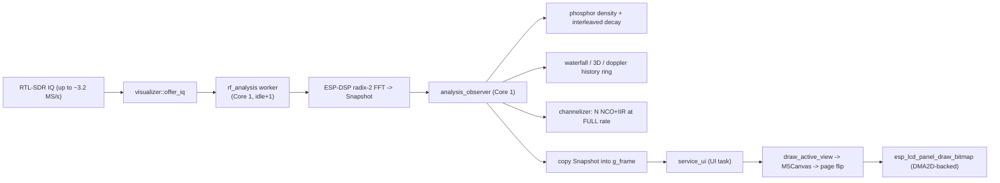

# RF Visualizer Resource-Efficiency Rebuild

> **Status: DESIGN ONLY — not implemented.** This is the plan of record for the
> Tab5 RF Visualizer rebuild. No code ships from this document directly; each
> phase below becomes its own landable change once implementation starts.
>
> **Sequencing with in-flight work:** implementation starts **after** the
> ADS-B enhancement branch is merged and this tree is rebased onto it.
> Rationale in [Merge strategy](#merge-strategy-relative-to-ads-b-work).

## Background and problem statement

The RF Visualizer (`apps/orcsdr-tab5/ui/rf_visualizer.{hpp,cpp}`,
`rf_visualizer_controls.{hpp,cpp}`) is a full-screen, 12-view RF visualization
surface inspired by classic Winamp visualizers (MilkDrop) and SDR instrument
displays. Three user-visible problems motivate this work:

1. **Modes blend together.** Twelve views exist but only about six data
   families, and several pairs are the same renderer wearing different
   clothing (spectrum vs peak-average, waterfall vs audio-spectrogram,
   constellation vs polar vs IQ scope). None of them has a distinct identity
   or an obvious "what is this for".
2. **Mode-specific controls largely don't work.** Roughly two-thirds of the
   ~190 control descriptors are never read by any renderer. Users adjust
   controls and see nothing change.
3. **Performance is poor and crashes have occurred.** Heavy views run at
   slideshow frame rates, the channelizer's solo-audio path can consume more
   than a full CPU core on the same core that runs reception DSP, and repeated
   PSRAM allocation/free on view switches creates fragmentation-driven
   allocation failures.

The user's goal for the rebuild: a systematic, per-view improvement pass with
a clear identity per mode, working mode-specific controls, context-aware mode
relevance (band + signal-above-noise), a Winamp-style ambient/screensaver
character, and resource efficiency that exploits the ESP32-P4's accelerators.

## Current architecture (as built)

- `rf_analysis` produces a `Snapshot` (1024-bin float spectrum, IQ ring,
  optional audio spectrum) on Core 1 at 16/33/100 ms depending on the
  `visual.quality` profile.
- `analysis_observer` runs **on the analysis task** and performs per-view
  accumulation synchronously: phosphor density decay, history rows, occupancy
  counters, and the channelizer's per-sample NCO/IIR pipeline.
- The UI task copies the snapshot and redraws. Full-repaint views double-buffer
  via the DSI panel's two framebuffers and `esp_lcd_panel_draw_bitmap`.
- Controls live in a static descriptor table
  (`rf_visualizer_controls.cpp`), persisted to NVS, exposed in a 3-row drawer
  and over the `RTL_VIS *` serial protocol.

## Evidence: findings from the code audit and hardware research

All findings below are grounded in the current tree and the vendored
components; hardware claims cite the ESP-IDF 5.5.4 docs and the Tab5 board
configuration in `M5GFX.cpp`.

### A. Dead control surface (audit of `rf_visualizer_controls.cpp` vs renderers)

Only controls actually read by a draw/apply path work today. Verified dead or
stubbed per view:

| View | Works today | Dead / stub / ignored |
|---|---|---|
| spectrum | `fft.size`, `fft.trace_thickness`, `fft.peak_hold_mode`, `fft.center_cursor` | `fft.window` (analysis only implements Hann), `overlap`, `detector`, `average_mode`, `average_time_ms`, `peak_hold_s`, `peak_decay_db_s`, `marker_count`, `marker_threshold_db` |
| waterfall | `palette`, `direction`, `speed`, `gamma`, `level_mode`, floors/ceilings | `history_s`, `bin_mapping`, `time_grid_s`, `frequency_labels` |
| phosphor | `half_life_s`, `accumulation`, `exposure`, `decay_curve`, `point_size`, `palette`, `background_reject_db` | `blur_px`, `rare_hold_s` |
| spectrum3d | `slices` only | `history_s`, `elevation_deg`, `azimuth_deg`, `zoom`, `depth_scale`, `z_gain`, `mesh_mode`, `color_mode`, `line_decimation`, `auto_orbit` |
| constellation | `source`, `phase_deg`, `symbol_rate`, `carrier_recovery`, `timing_recovery`(partial) | `profile`, `points`, `persistence_s`, `point_size`, `normalize`, `axis_scale`, `dc_remove`, `show_ideal` |
| iqscope | **none** (fixed I/Q traces) | all: `traces`, `timebase`, `vertical_scale`, `position`, `coupling`, `trigger_*`, `pretrigger_pct`, `decimation`, `interpolation`; `arm_single` is a no-op message |
| polar | `rotation_deg` (via transform) | `mode`, `phase_reference`, `radial_scale`, `normalize`, `persistence_s`, `magnitude_gate_db`, `trail_width`, `angle_labels`, `show_histogram` |
| occupancy | `band_count`, `threshold_offset_db`, `minimum_dwell_ms`, `time_bin_ms` | `band_plan`, `threshold_mode`, `absolute_dbfs`, `integration`, `basis`, `alert_*`, `sort_bars`; `save_csv` prints "CSV EXPORT QUEUED" and does nothing |
| peak_average | `show_live/average/max` | `average_mode`, `average_time_s`, `live_smoothing`, `max_mode`, `hold_time_s`, `decay_db_s`, `marker_count`, `shared_scale`, `trace_width` |
| doppler | `span_hz`, `history_s`, `tracking`, `track_window_hz`, `threshold_db`, `fft_size` | `window`, `integration`, `reference`, `fixed_reference_hz`, `detrend`, `units`, `show_fit`, `lock_track`; `save_csv` stub |
| channelizer | `count`, `plan`, `guard_pct`, per-channel `demod/squelch/offset` | `layout`, `bandwidth`, `scale_mode`, `metric`, `threshold_*`, `refresh_hz`, `tile_labels`, `edit_channel`, `reset_plan` |
| audio_spectrogram | `time_span_s`, `palette`, floors/ceilings, `normalization`, `fft_size` | `source`, `sample_rate`, `window`, `overlap`, `max_frequency`, `frequency_scale`, `preemphasis`, `filter_overlay`, `cursor` |
| common | `center_hz`, `span_hz`, floors/ceilings, `auto_levels`, `freeze`, `quality`, `reset` | `gain_mode`, `gain_db` (queue nothing), `display.grid`, `display.palette` (trace color fixed), `fps_overlay` |

Additional confirmed UX bug: tapping the value button in the control drawer
always increments the control (`adjust_control(c, x < 795 ? -1 : x > 1065 ? 1 : 1)`
— the middle zone adds +1).

### B. Performance root causes

1. **Rotated panel per-pixel path (largest single factor).** The Tab5 panel is
   native 720×1280 (M5GFX `board_M5Tab5` config); the app runs `rotation = 1`
   for 1280×720 landscape. In M5GFX 0.2.27 (`Panel_FrameBufferBase.cpp`),
   rotation 0 + same-format pushes take a row-`memcpy` fast path; **any
   rotation switches every draw to per-pixel `_rotate_pixelcopy` /
   `writeFillRectPreclipped` writes through a `_lines_buffer[]` column
   indirection.** Logical-horizontal runs become physical columns: each pixel
   lands in its own 128-byte cache line (~256 B of traffic per 2-byte pixel
   worst case). `fillRect` is the exception (post-swap full-row `memset`).
   Consequence: phosphor and doppler each push ~295 logical rows per frame —
   ~90 MB of scattered traffic per frame → 1–3 fps. IQ scope, grid H-lines,
   and trace segments pay a 2–100× amplification.
2. **Per-frame full-buffer memcpy.** `enable_page_flip()` copies the entire
   1.84 MB front→back buffer on every `service_ui`, even when nothing changed
   (~7 ms/frame of pure CPU).
3. **Per-frame chrome redraw.** `draw_frame_chrome()` + `draw_grid()` refill
   the whole 1280×720 surface (~8 ms of sequential fill + scattered grid
   lines) every full-repaint frame, including when only the plot changed.
4. **Producer overload on Core 1.** Density decay, history writes, occupancy
   updates, and the channelizer NCO run inside `analysis_observer` on the same
   core as audio/DSP. The channelizer processes N channels × full sample rate:
   at 2.4 MS/s × 8 channels × ~27 ops ≈ **518M ops/s ≈ 1.3 cores** — the
   mechanism behind audio drops, IDLE1 starvation, and watchdog resets.
5. **PSRAM churn.** `allocate_view_buffers()` frees and reallocates up to
   8 MiB on every view switch; history is not retained per mode, so switching
   modes repeatedly fragments PSRAM and can fail allocation.
6. **Rate bugs already documented** in `docs/dsp/DSP_ARCHITECTURE_AUDIT.md`:
   `sample_rate_sps / 48000u` truncation in the channelizer, LSB/USB `I ± Q`
   is not a sideband demodulator, FM discriminator runs unfiltered.

### C. Hardware facts and accelerators (verified)

- ESP32-P4 v1.3, 2× RISC-V 400 MHz, single-precision FPU; 32 MiB octal PSRAM
  @ 200 MHz; L2 256 KiB / 128-byte lines; 768 KiB internal SRAM.
- DSI scanout of 720×1280 RGB565 @ 60 Hz ≈ **110 MB/s of permanent PSRAM
  read** by the display controller. Two framebuffers = 3.7 MiB always live.
  PSRAM bandwidth is the shared budget everything else competes for.
- `sdkconfig` confirms `SOC_DMA2D_SUPPORTED` and `SOC_ASYNC_MEMCPY_SUPPORTED`.
- **PPA** (`esp_driver_ppa`): hardware bilinear scale/rotate-90-180-270/mirror
  (SRM, RGB565↔RGB565), alpha **blend** (+ color-keying), and **fill**, with
  non-blocking queued transactions. Output buffers in PSRAM must be cache-line
  aligned (128 B). SRM bilinear softens edges (good for ambient scenes, wrong
  for text — HUD stays full-res).
- **DMA2D / GDMA async memcpy**: M5GFX 0.2.27 already creates the DSI-DPI
  panel with `use_dma2d = true`, so `esp_lcd_panel_draw_bitmap` — already used
  by `present_canvas()` — is hardware-accelerated today. M5GFX's own drawing
  is pure CPU writes (verified: zero `ppa_`/`dma2d` hits in the vendored tree;
  `initDMA/waitDMA/dmaBusy` are empty).
- M5GFX `M5Canvas` (LGFX_Sprite) supports **indexed 8-bit palette sprites**
  (`createPalette(const uint16_t*, count)`): 1 B/pixel. `pushRotateZoom` /
  `pushAffine` are CPU per-pixel — never at frame rate; PPA replaces them.
- No hardware FFT on the P4; ESP-DSP radix-2 float stays.

### D. Quantified expectation (modeled)

| Item | Today | Target | Basis |
|---|---|---|---|
| Phosphor / Doppler | ~90 MB scattered PSRAM traffic/frame → 1–3 fps | ~1.4 MB row-sequential → 30–60 fps | ~60× traffic reduction |
| Spectrum-family views | 10–25 fps | 30–60 fps | grid scatter + chrome removal, row-span traces |
| 3D history | 5–15 fps (CPU line loop) | 30–60 fps + softer look | low-res sprite + PPA 4× upscale |
| Page-flip copy | +7 ms/frame, always | 0 | dirty-flag |
| Chrome redraw | +8 ms/frame | amortized (only on HUD change) | partial redraw |
| Channelizer solo audio | ≈1.3 cores on Core 1 | ≤0.1 core | decimate-first / selected-channel |
| View-switch allocations | fragmentation → crash class | zero runtime allocation | preallocate at `initialize()` |

Confidence: high for traffic math, op counts, and deterministic copies;
medium for absolute fps (depends on real PSRAM scattered throughput).
`RTL_VIS STATUS` already reports per-view `presentation_fps`/`analysis_fps`
over serial — this is the built-in A/B instrument.

## Goals and non-goals

**Goals**

1. Every view has a distinct identity and purpose; the chooser communicates it.
2. Every exposed control does something (wired to its renderer) or is removed.
3. Every view meets its frame-rate class (see Phase 3) with zero reception
   impact (no audio drops, no IDLE1 starvation).
4. Mode relevance reacts to band and signal context (FM broadcast gets music
   and wide-channel views; digital bands get constellation/doppler; scanning
   gets occupancy).
5. A Winamp-style ambient/screensaver mode (auto-cycle, cross-fade,
   audio-reactive) exists as a first-class feature.
6. Zero runtime allocation after entry; preallocated per-mode state.

**Non-goals**

- No changes to `esp-rtl-sdr` (pinned, separate repo).
- No edits to the vendored M5GFX component; all work is in the app layer and
  IDF driver usage.
- No new `RTL_VIS` protocol removals — the serial surface stays compatible;
  additions only (e.g. `RTL_VIS BENCH`).
- No behavior changes bundled into structural moves (repo ground rule).
- Not rewriting `rf_analysis`'s FFT core; only moving where per-view
  accumulation runs.

## Design decisions

### D1 — Producer stays copy-only

`analysis_observer` becomes: copy `Snapshot` into `g_frame` and nothing else.
All accumulation (density decay, history rows, occupancy) moves to the UI
task's cadence, driven off the same snapshot, with its own mutex-bounded
budget. The channelizer audio path is removed from the observer entirely
(see D4/Phase 1) and replaced by a decimate-first implementation.

Rationale: Core 1 runs reception DSP. The visualizer may never be able to
starve it; accumulation is cheap enough to run on the UI task and this also
removes the producer-side mutex hold that periodically blocks the UI.

### D2 — Portrait-native render surfaces + PPA compose

All visualizer drawing moves to **rotation-0 surfaces** so M5GFX's row-memcpy
fast path applies:

- Ambient views render into low-resolution sprites (e.g. 320×180 or
  360×640), then **PPA SRM** rotates/scales into the back framebuffer with
  bilinear filtering (the MilkDrop pipeline).
- Instrument views render into portrait-native row buffers (720×1280 layout)
  and blit into the framebuffer row-sequentially; text/grid/readouts stay
  full-resolution and sharp.
- **PPA blend** composites HUD/overlays and performs screensaver cross-fades;
  **PPA fill** replaces big clears.
- Present keeps `esp_lcd_panel_draw_bitmap` (already DMA2D); the CPU
  front→back copy in `enable_page_flip()` is replaced by dirty tracking.

A thin `vis_blit` module owns PPA clients, 128-byte-aligned PSRAM buffers,
and a fallback CPU path (self-check requires both).

### D3 — Mode taxonomy: instruments vs ambient

- **Instrument views** (answer one RF question each): Spectrum (absorbs
  peak/average as toggleable traces), Waterfall, Constellation (absorbs polar
  as a projection option), IQ Scope (becomes a real scope), Doppler,
  Occupancy.
- **Ambient views** (the Winamp set): Phosphor, 3D History, Channelizer
  Tiles, Audio Spectrogram.

Net mode count drops from 12 to ~10 with zero lost capability; the chooser
gains a purpose line per mode.

### D4 — Control lifecycle rule

Every `ControlDescriptor` must be referenced by at least one behavior or
renderer path, enforced by extending `controls_self_check()` (source-scan of
`rf_visualizer.cpp` + new render modules for each non-common control id).
Dead controls are wired first where cheap, deleted where the concept died.
Stub actions (`save_csv`) either write real CSV or are removed.

### D5 — Context-aware relevance

`Runtime` gains a compact `BandContext` (band, demod, stereo, span) and
`Snapshot` already carries `noise`/`strongest`/`occupied_bandwidth_hz`. A
small relevance table orders the chooser and tags "recommended" modes:

- FM broadcast → Waterfall, Phosphor, Audio Spectrogram first; channelizer
  retiles for WFM (~150–200 kHz) or hides.
- AM/SSB/CB → Spectrum, Waterfall, Audio Spectrogram.
- Digital (P25/ADS-B/LoRa) → Constellation, Doppler, Waterfall.
- Scanning → Occupancy first.

### D6 — Screensaver/ambient mode

Auto-cycles the ambient set with PPA-blend cross-fades, auto-dims the HUD,
wakes on touch, and optionally reacts to audio (envelope/energy from
`offer_audio` drives phosphor exposure, 3D amplitude, bloom). Implemented
after the render pipeline exists (Phase 6).

## Phasing

Ground rules (inherited from `phasing.md`):

- Each phase lands independently; the firmware **builds and flashes green at
  every step**. No multi-day broken builds.
- No behavior changes bundled into structural moves.
- Flash-and-verify on hardware at each phase close; evidence labels:
  **Build-verified** ≠ **Hardware-verified**.
- Every render-affecting phase closes with an A/B `RTL_VIS STATUS`
  `presentation_fps` comparison and a screenshot set via
  `tools/capture_visualizers.py`.

### Phase 0 — Baselines and instrumentation

Goal: make every later claim measurable.

1. [ ] Capture per-view baseline `presentation_fps`/`analysis_fps` via
      `RTL_VIS STATUS` (5 s per view, quality Max and Balanced), recorded
      into this document's appendix.
2. [ ] Add `RTL_VIS BENCH` (additive): cycles all views for N frames each and
      reports per-view fps + drop deltas.
3. [ ] Capture baseline screenshot set; keep as regression reference.

Exit: baseline table recorded; `RTL_VIS BENCH` lands without changing any
render path. **Hardware-verified.**

### Phase 1 — Correctness and producer offload (no visual changes)

Goal: eliminate the Core-1 overload and the known rate bugs; zero intended
pixel changes.

1. [ ] Fix `sample_rate_sps / 48000u` truncation in the channelizer
      (fractional decimation phase accumulator).
2. [ ] Move density decay, history writes, and occupancy updates out of
      `analysis_observer` into the UI-task accumulation step; observer
      becomes snapshot-copy-only.
3. [ ] Replace full-rate channelizer NCO with decimate-first processing
      (channel filter at 240k or selected-channel-only at 48k); solo audio
      output must remain bit-compatible with today's demod/squelch behavior.
4. [ ] Remove the unconditional `enable_page_flip()` full-buffer memcpy;
      dirty-flag the copy so it runs only when the front buffer changed.
5. [ ] Keep `g_frame`/`g_history` mutexes; re-check lock-hold durations via
      the HUD's drop counters.

Exit: 30-minute soak with channelizer soloing at 2.4 MS/s shows zero audio
drops and zero IDLE1 resets; `analysis_fps` unchanged at each quality
profile; screenshots pixel-identical to baseline. **Hardware-verified.**

### Phase 2 — Accelerated present pipeline (`vis_blit` + portrait-native surfaces)

Goal: infrastructure only — restore M5GFX fast paths and introduce PPA;
visual output stays pixel-equivalent (subject to the SRM blur exception
below, which is gated off in this phase).

1. [ ] Add `esp_driver_ppa` (and `esp_driver_dma` if needed) to
      `main/CMakeLists.txt`; add a `vis_blit` module: PPA SRM/blend/fill
      clients, 128-byte-aligned PSRAM allocator, CPU fallback, self-check.
2. [ ] Introduce portrait-native (rotation 0) offscreen surfaces for
      instrument views; render rows sequentially; blit into the back
      framebuffer. Validate the M5GFX row-memcpy fast path is hit (e.g. via a
      temporary counter or perf trace).
3. [ ] Switch `present_canvas` to the clean DMA2D path; confirm
      `use_dma2d` panel config is active and `esp_lcd_panel_draw_bitmap`
      copies are asynchronous where safe.
4. [ ] PPA SRM path built and exercised by a diagnostic mode only
      (no user-visible switch yet).

Exit: all views render through the new pipeline with no visual regression
against Phase 0 screenshots; `presentation_fps` of phosphor/doppler
measured ≥ 30 fps. **Hardware-verified.**

### Phase 3 — Per-view renderer rewrite (one view per change)

Goal: systematic per-view improvement with distinct feel. Each sub-step is a
separate landable change with its own A/B numbers.

1. [ ] **Phosphor**: density map → 8-bit palette sprite; prebuilt row pair,
      single fast-path push; decay unchanged in output. Target 30–60 fps.
2. [ ] **Doppler**: contiguous row-buffer push (same render, sequential
      writes). Target 30–60 fps.
3. [ ] **Spectrum (+ merged Peak/Average)**: min/max column spans into row
      buffers; grid/border into a persistent layer (no per-frame redraw);
      peak/average become toggleable traces within spectrum (view list drops
      `peak_average`). Target 60 fps at Balanced.
4. [ ] **Waterfall / Audio Spectrogram**: row-memcpy pushes; scroll via
      ring-buffer rendering (or DMA2D row move) instead of `copyRect`
      thrash. Target 60 fps.
5. [ ] **Constellation (+ polar projection)**: u8 hit-map sprite
      (256×256), palette LUT, PPA upscale with persistence overlay. Target
      30–60 fps with denser point counts.
6. [ ] **IQ Scope**: real scope semantics — trigger, timebase, pre-trigger,
      min/max column rendering. Wire `iqscope.*` controls.
7. [ ] **3D History**: low-res sprite (320×180) lines/surface strips, PPA
      4× upscale, color-by-age; wire camera controls (`elevation`,
      `azimuth`, `zoom`) to the projection.
8. [ ] **Channelizer**: per-tile small sprites, PPA fills, WFM-aware tile
      geometry (Phase 5 completes band logic).
9. [ ] **Occupancy**: PPA fill cells; real CSV export on `save_csv` or
      remove the control.

Exit per step: that view's target fps met, controls wired per D4, screenshot
in the regression set. Cumulative exit: all views ≥ 30 fps at Balanced with
live audio, zero drops. **Hardware-verified.**

### Phase 4 — Control surface purge

Goal: every exposed control works; the drawer is honest.

1. [ ] Extend `controls_self_check()` to fail on any non-common control id
      not referenced outside `rf_visualizer_controls.cpp`.
2. [ ] Delete or wire the Phase-0 dead list per view (table in §A); remove
      stub actions.
3. [ ] Fix the value-button tap bug (tap = edit/open picker or no-op, never
      implicit +1).
4. [ ] Wire `gain_mode`/`gain_db` to queue real actions (or remove).

Exit: audit script passes; drawer shows only functional controls; regression
self-checks green. **Build-verified + Hardware-verified.**

### Phase 5 — Mode identity and band context

Goal: each mode's purpose is obvious; relevance adapts to the band.

1. [ ] Mode metadata: purpose line, instrument/ambient class, relevance
      table (D5) shown in chooser and name banner.
2. [ ] `BandContext` plumbed through `Runtime`; chooser ordering and
      "recommended" badges.
3. [ ] Channelizer WFM behavior on FM broadcast (wide tiles, de-emphasis
      note, or auto-suggest Audio Spectrogram).
4. [ ] Signal-aware hints: signal-above-noise (`Snapshot.noise`/`strongest`)
      switches suggested trace/occupancy defaults.

Exit: on 96.1 MHz the chooser leads with waterfall/spectrogram and the
channelizer no longer presents NFM-width tiles by default; on P25 the
constellation/doppler come first. **Hardware-verified.**

### Phase 6 — Screensaver / ambient mode (the Winamp payoff)

1. [ ] Ambient auto-cycle with PPA-blend cross-fades and HUD auto-dim;
      wake on touch.
2. [ ] Audio-reactive layer: envelope/energy from `offer_audio` drives
      phosphor exposure, 3D amplitude, channelizer bloom.
3. [ ] "DEMO" quality profile for the ambient set (lowest CPU, best look).

Exit: screensaver runs 10 minutes on battery with no resets and no audio
degradation; visual captures show distinct per-mode identity.
**Hardware-verified.**

### Phase 7 — Polish (optional, post-acceptance)

1. [ ] Per-view custom presets remain working across the mode merges.
2. [ ] `RTL_VIS BENCH` promoted into `tools/capture_visualizers.py` CI-ish
      check where feasible.
3. [ ] Update `docs/README` mode list and `docs/images` capture set.

## Verification strategy

- **Measurement:** `RTL_VIS STATUS` (exists) + `RTL_VIS BENCH` (Phase 0) for
  per-view fps and drops; HUD's existing `P/A/DROP` overlay as the on-device
  cross-check.
- **Correctness:** extend `self_check()` per D4; keep `capture_visualizers.py`
  screenshot discipline; `TAB5_BUILD_POLICY.md`'s full-repaint visualizer
  exercise stays part of every flash validation.
- **Stability:** 30-minute soaks with channelizer solo + screensaver; watch
  `usb_overruns`, `consumer_drops`, `audio_drops` deltas.
- **Evidence labels:** every phase exit carries Build-verified and/or
  Hardware-verified per `PROJECT_STATUS.md` discipline.

## Merge strategy relative to ADS-B work

**Recommendation: do not start implementation now.** The visualizer phases
touch `main.cpp` integration points (`service_visualizer`, `open_visualizer`,
the `offer_iq`/`offer_audio` wiring near the receiver loop, `screen_controller`
entries) — the same 18k-line file the in-flight ADS-B enhancements are
editing. Phases 1–3 are designed to land incrementally, which means a
long-lived branch if started now, plus rebase churn exactly where ADS-B and
this work would collide.

This document is inert (docs-only) and has no merge risk. The clean sequence
is:

1. ADS-B work merges (Claude).
2. Rebase this tree onto it.
3. Land Phase 0/1 as the first change; continue one phase at a time.

If ADS-B stalls and we must start early, only Phase 0 and the
`rf_visualizer.cpp`-internal parts of Phase 1 (items 1–2) are safe to
backport, since they touch nothing outside the visualizer files; everything
else waits for the rebase.

## Risks and mitigations

| Risk | Mitigation |
|---|---|
| PPA SRM bilinear blur visible on instrument text | HUD/text rendered full-res; SRM only for ambient scenes (D2) |
| PPA transactions contend for PSRAM bandwidth during scanout | non-blocking transactions; benchmark burst length; CPU fallback path in `vis_blit` |
| Producer→consumer move introduces snapshot lag or dropped frames | consumer runs at same cadence with its own budget counter; regression screenshots + `input_drops` monitoring |
| Channelizer decimate-first changes solo-audio character | keep demod/squelch semantics; A/B audio check in Phase 1 exit |
| Mode merges (peak_average, polar) break presets/serial compatibility | keep view slugs stable via aliases during transition; `RTL_VIS` protocol compatibility is a stated non-goal to preserve |
| Preallocation increases steady-state PSRAM footprint | capped by existing `memory_budget()` quality tiers; measured in Phase 2 exit |
| Fragmentation from PPA aligned buffers | single dedicated arena, allocated once at `initialize()`, never freed per view |
